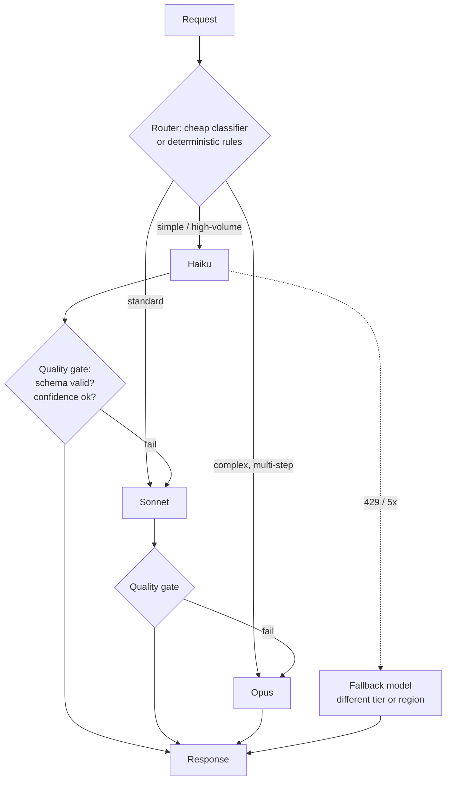

# 01 — LLM and Claude Foundations

> **Domain mapping:** cross-cutting. Nothing here is a domain on its own, but every domain assumes it.
> If you are an experienced backend engineer, the mental model to install is: *an LLM is a stateless,
> non-deterministic, token-billed function whose input is a string and whose output is a probability
> distribution you sample from.* Everything else follows.

---

## 1.1 Large language model fundamentals **[General LLM]**

### 1.1.1 What an LLM actually is

**Definition.** A large language model is a neural network trained to predict the next token in a sequence,
given all previous tokens. That is the entire objective. "Reasoning", "instruction following" and "tool use"
are *emergent behaviours* of that objective plus post-training, not separate mechanisms.

**Why it matters architecturally.** Because the model is a next-token predictor:

- It has **no persistent state**. Every call is a pure function of the bytes you send.
- It has **no ground truth oracle**. It produces the most plausible continuation, which is why hallucination is
  a *design condition*, not a bug you can patch out.
- It has **no execution capability**. It cannot call your database. It can only emit text that your harness
  interprets as a request to call your database. This is the single most important fact behind tool use (§05).

```
        ┌──────────────────────────────────────────────┐
        │           Your harness (you own this)        │
        │                                              │
        │  state ──▶ prompt assembly ──▶ [ LLM ] ──▶ parse ──▶ act
        │    ▲                                              │
        │    └──────────────── result ──────────────────────┘
        └──────────────────────────────────────────────┘

The LLM is the *only* box you do not control. Everything reliable in an
LLM system lives in the boxes around it.
```

### 1.1.2 The training pipeline

| Stage | What happens | Architectural consequence |
|---|---|---|
| **Pretraining** | Next-token prediction over a very large corpus. Produces a base model with broad world knowledge but no notion of "being helpful". | Explains the **knowledge cutoff**. Anything after the cutoff must arrive via context (RAG, tools, web search) — never assume the model knows it. |
| **Instruction tuning / SFT** | Supervised fine-tuning on (instruction, good response) pairs. | This is why a system prompt works at all. It is a *learned convention*, not a hard-coded channel. |
| **RLHF / preference optimisation** | The model is optimised against a reward signal derived from human (or AI) preference comparisons. Variants: PPO-style RLHF, DPO, and **[Claude-specific]** Constitutional AI / RLAIF, where a written set of principles supplies part of the preference signal. | Explains refusals, hedging, and "safety" behaviour. Also explains why the same prompt can behave differently across model versions — the preference model changed. |
| **Inference** | Forward pass, sample a token, append, repeat. | This is what you pay for and what you wait for. Output tokens are generated **serially**; input tokens are processed in **parallel**. Hence output tokens cost ~5× input and dominate latency. |

> **Why an architect cares:** the input/output asymmetry is the root of almost every cost and latency decision in
> §14. A 50 000-token prompt with a 200-token answer is *cheap and fast*. A 500-token prompt with a
> 20 000-token answer is *expensive and slow*. Prompt size mostly costs money; output size costs money **and**
> wall-clock time.

### 1.1.3 Tokens and tokenisation

**Definition.** A token is a sub-word unit produced by a byte-pair-encoding-style tokenizer. Rough English
heuristic: **1 token ≈ 4 characters ≈ 0.75 words**. Code, JSON, non-Latin scripts and UUIDs tokenise far worse
(JSON punctuation and base64 can approach 1 token per 1–2 characters).

**[Claude-specific]** Anthropic's tokenizer is *not* OpenAI's. **Never estimate Claude token counts with
`tiktoken`.** Use the token counting endpoint:

```python
from anthropic import Anthropic
client = Anthropic()

count = client.messages.count_tokens(
    model="claude-opus-5",
    system=SYSTEM_PROMPT,
    tools=TOOLS,
    messages=messages,
)
print(count.input_tokens)   # exact, free, same tokenizer as the real request
```

**[Claude-specific]** The tokenizer has changed across model generations (Opus 4.7 introduced a new tokenizer
carried forward by Opus 4.8, Opus 5 and Fable 5). If you migrate models, **re-baseline your token budgets** —
a prompt that fit before may not fit now, and per-request cost can shift even at identical pricing.

**Practical failure this causes.** Teams size their chunking, their context budget and their cost model on an
estimate, ship, and discover a 30% cost overrun. Count tokens; do not estimate.

### 1.1.4 Context window, input tokens, output tokens

- **Context window** — the maximum number of tokens the model can attend to in one request. It covers
  *system prompt + tool definitions + full message history + the response being generated*. It is a per-request
  budget, not a per-conversation one.
- **Input tokens** — everything you send. Billed at the input rate; can be cached (§08.3).
- **Output tokens** — everything generated, **including thinking tokens** even when the thinking text is not
  returned to you. Billed at the output rate.

**[Claude-specific] Current context windows (August 2026 — verify with `GET /v1/models`):**

| Model | Model ID | Context | Max output |
|---|---|---|---|
| Claude Fable 5 | `claude-fable-5` | 1M | 128K |
| Claude Opus 5 | `claude-opus-5` | 1M | 128K |
| Claude Opus 4.8 / 4.7 / 4.6 | `claude-opus-4-8` / `-4-7` / `-4-6` | 1M | 128K |
| Claude Sonnet 5 | `claude-sonnet-5` | 1M | 128K |
| Claude Sonnet 4.6 | `claude-sonnet-4-6` | 1M | 128K |
| Claude Haiku 4.5 | `claude-haiku-4-5` | 200K | — |

**[Claude-specific]** The Models API is the source of truth: `client.models.list()` /
`client.models.retrieve(id)` return `max_input_tokens` (the context window), `max_tokens` (the output cap) and a
`capabilities` object. There is no field called `context_window`. **Discover capabilities at runtime rather than
hard-coding them** — this is a genuinely good production pattern and a plausible exam answer.

> **Trap.** "The context window is 1M, so I can put the whole knowledge base in the prompt." You *can*, and it
> will work, and it will cost you ~$5 per request in input tokens at Opus rates before caching, add seconds of
> latency, and degrade accuracy through context dilution (§08.4). Long context is a capability, not a strategy.

### 1.1.5 Attention and the transformer, in exactly the depth you need

Each layer computes, for every token position, a weighted sum over all other positions. The weights ("attention")
come from query·key similarity. Two consequences you must be able to reason about:

1. **Cost is superlinear in sequence length.** Self-attention is O(n²) in sequence length for the naive
   formulation. Modern serving stacks mitigate this heavily, but the direction of the curve is why doubling your
   context does not merely double your latency.
2. **Attention is a soft, learned retrieval mechanism, and it is imperfect.** Relevant tokens compete with
   irrelevant ones. Adding noise to a prompt does not just waste money — it *actively degrades* the model's
   ability to find the signal. This is the mechanism behind **lost-in-the-middle** (§1.4) and behind the single
   most useful context-engineering rule: **context quality beats context quantity.**

**KV cache.** During generation the keys and values for previous tokens are cached so each new token only
attends against cached state. This is why *prefix* caching (§08.3) is possible at all, and why a cache hit
requires a **byte-identical prefix** — the cached tensors correspond to exact token positions.

### 1.1.6 Sampling: temperature, top-p, determinism

Given the next-token probability distribution:

- **Temperature** rescales the logits. `0` → always take the argmax (greedy). `1.0` → sample from the raw
  distribution. Higher → flatter, more surprising.
- **Top-p (nucleus)** truncates to the smallest set of tokens whose cumulative probability ≥ p, then samples.
- **Top-k** truncates to the k most likely tokens.

**Guidance [General LLM]:** tune *one* of temperature or top-p, not both. Low temperature for extraction,
classification, code, and anything you will parse. Higher temperature only for genuinely creative generation.

**[Claude-specific] — this is a live API-drift trap.** On current Claude models
(**Fable 5, Opus 5, Opus 4.8, Opus 4.7, Sonnet 5**) the sampling parameters `temperature`, `top_p` and `top_k`
have been **removed and return HTTP 400**. Depth and verbosity are controlled instead by:

```python
response = client.messages.create(
    model="claude-opus-5",
    max_tokens=16000,
    thinking={"type": "adaptive"},              # Claude decides when/how much to think
    output_config={"effort": "high"},           # low | medium | high | xhigh | max
    messages=[...],
)
```

Opus 4.6 and Sonnet 4.6 still accept sampling parameters. **If an exam option or a code review shows
`temperature=0` against Opus 5, that is a bug.**

**Determinism.** Even at temperature 0, LLM inference is **not bit-reproducible** in practice: floating-point
non-associativity, batching effects, and hardware/kernel differences all perturb results. Treat non-determinism
as a **system property**, and design accordingly:

- Validate outputs, never assume a shape (§04).
- Make tool executions **idempotent** so a retry is safe (§12.3).
- Use pinned model IDs so at least the *model* is fixed (§18.5).
- Test statistically over a dataset, not by asserting on one string (§11).

### 1.1.7 Capabilities vs limitations

| Genuine strength | Genuine weakness |
|---|---|
| Natural-language understanding, summarisation, extraction | Exact arithmetic and precise counting |
| Code generation and code comprehension | Retrieval of exact facts from memory (dates, IDs, prices) |
| Format transformation, classification with fuzzy boundaries | Guaranteed schema conformance without enforcement |
| Multi-step planning over an ambiguous goal | Real-time or post-cutoff knowledge |
| Tolerating messy, unstructured input | Determinism and auditability |

**The engineering rule this yields:** give the model the *judgement*, give deterministic code the *guarantees*.
An LLM should decide **which** invoice to refund; a database transaction with a constraint should decide
**whether the refund is legal**.

---

## 1.2 Claude model fundamentals **[Claude-specific]**

### 1.2.1 Families and positioning

Anthropic ships tiers rather than a single model, and the tier names are stable even as versions advance:

| Tier | Positioning | Typical use |
|---|---|---|
| **Fable / Mythos** | Most capable; long-horizon agentic work, hardest reasoning | Deep research agents, long autonomous runs |
| **Opus** | Frontier general-purpose | Coding agents, complex orchestration, supervisors |
| **Sonnet** | Balanced capability/cost | The default workhorse for most production traffic |
| **Haiku** | Fast and cheap | Classification, routing, extraction, subagent workers |

**Pricing (per 1M tokens, Claude API first-party, August 2026 — verify before quoting):**

| Model | Input | Output |
|---|---|---|
| `claude-fable-5` | $10.00 | $50.00 |
| `claude-opus-5` | $5.00 | $25.00 |
| `claude-sonnet-5` | $3.00 | $15.00 |
| `claude-haiku-4-5` | $1.00 | $5.00 |

Bedrock and Vertex are partner-operated with **separate pricing**; Microsoft Foundry bills at standard API rates
through the Microsoft Marketplace. If a scenario says "we are on Bedrock", do not quote first-party prices.

### 1.2.2 Reasoning: adaptive thinking and effort

**[Claude-specific]** Claude exposes an *extended thinking* mode where the model produces internal reasoning
before its answer.

**Current API (Opus 4.6+ and all 5-series):**

```python
thinking={"type": "adaptive"}                 # Claude chooses depth per request
output_config={"effort": "xhigh"}             # low | medium | high | xhigh | max
```

**Historical difference worth knowing** (it appears in old code and in distractor options): older models used a
fixed budget, `thinking={"type": "enabled", "budget_tokens": N}`. That parameter is **deprecated on Opus 4.6 /
Sonnet 4.6 and returns a 400 on Fable 5, Opus 5, Opus 4.8, Opus 4.7 and Sonnet 5.** Adaptive thinking plus
`effort` replaces it. Do not write `budget_tokens` in new code.

Behavioural details that matter in production:

- Thinking tokens are **billed as output tokens** whether or not you can see them.
- `thinking.display` controls visibility only. On Fable 5 / Opus 5 / Opus 4.8 / 4.7 / Sonnet 5 the default is
  `"omitted"` — you get `thinking` blocks with empty text. Set `display: "summarized"` if you stream reasoning
  to a user, otherwise the UI shows a long silent pause.
- The **raw chain of thought is never exposed** on any model.
- When continuing a conversation on the **same** model, echo thinking blocks back unchanged. Other models ignore
  them silently.
- **Effort is the main cost/quality dial.** `xhigh` is the sweet spot for coding and agentic work on the 5-series;
  `low` is right for cheap subagents; `max` when correctness dominates cost.

> **Trap [Claude-specific].** Disabling thinking on Opus 5 (`thinking={"type":"disabled"}`) has two documented
> failure modes: the model may write a tool call into *visible text* instead of emitting a `tool_use` block (the
> call silently never runs), and it may leak internal XML tags into the response. If you need to cut cost,
> **lower `effort`, don't disable thinking.**

### 1.2.3 Multimodal and document input

**[Claude-specific]** Claude accepts images (`image` content blocks, base64 or URL source) and PDFs/text
(`document` content blocks, base64 or a Files API `file_id`). PDF limits: 32 MB request, 600 pages (100 on
200K-context models). The content-block type must match the file's MIME type.

**Citations** are a first-class feature: set `citations: {"enabled": true}` on document blocks (all or none) and
the response splits into text blocks where cited ones carry a `citations` array with `cited_text` and a location
(`char_location`, `page_location`, or `content_block_location`). This is the *supported* way to build a grounded
document-QA system without hand-rolling span matching — and it is **incompatible with
`output_config.format`** (returns 400). That incompatibility is a real architecture decision: **structured
output or citations, not both, in one call.**

### 1.2.4 Tool use, structured output, streaming

All three are features of the single `POST /v1/messages` endpoint, not separate APIs. Covered in depth in §05,
§04 and §02.5 respectively. The one-line versions:

- **Tool use** — you declare JSON-Schema tools; Claude emits `tool_use` blocks; *you* execute and return
  `tool_result`.
- **Structured outputs** — `output_config: {format: {...}}` constrains the response to a JSON Schema; `strict:
  true` on a tool definition guarantees valid tool arguments.
- **Streaming** — server-sent events; required in practice for `max_tokens` above ~16K to avoid HTTP timeouts.

### 1.2.5 Model versioning and lifecycle

- Model IDs are stable strings (`claude-opus-5`). **Do not append date suffixes** you half-remember from
  training data.
- Pin a specific model ID in production config; never let a "latest" alias change behaviour under you.
- Treat a model upgrade as a **release**, gated by your evaluation suite (§11.7, §18.3).
- Older models are eventually retired. Have a migration runbook, and re-tune prompts and `effort` on migration —
  prompts written for an older model are frequently over-prescriptive and *reduce* quality on newer ones.

---

## 1.3 Model selection **[Architecture + Claude-specific]**

### 1.3.1 The selection axes

| Axis | Question to ask | Pushes you toward |
|---|---|---|
| **Quality** | Does a wrong answer cost more than the model does? | Larger model |
| **Latency** | Is a human waiting on the first token? | Smaller model + streaming |
| **Cost** | What is the per-request budget × volume? | Smaller model + caching + batch |
| **Context** | Does one request need >200K tokens? | 1M-context model (excludes Haiku 4.5) |
| **Reasoning** | Multi-step planning, ambiguity, novel problems? | Opus/Fable + higher `effort` |
| **Tool use** | Long tool chains, careful argument construction? | Opus tier; Haiku is weaker at long chains |
| **Multimodal** | Images/PDFs in the input? | Any current model; check capabilities via Models API |
| **Reliability** | Is behavioural stability across versions critical? | Pin version; expand eval suite |
| **Throughput** | Thousands of requests/minute? | Smaller model, Batch API, rate-limit planning |

### 1.3.2 The default recommendation

**Start at Sonnet.** Measure. Move up only where evaluation shows a quality gap that matters; move down only
where evaluation shows no gap. "Choose the cheapest model that passes your eval" is the correct posture — and
"we chose Opus because it's the best" with no eval is the wrong answer on the exam and in review.

### 1.3.3 Fallback, routing, and cascading — three different things

These are commonly conflated. Be precise:

| Pattern | Trigger | Purpose | Diagram |
|---|---|---|---|
| **Fallback** | The primary *failed* (429, 5xx, refusal, timeout) | Availability | `A → (error) → B` |
| **Routing** | Classify the request *up front*, send it to the right model | Cost/latency at equal quality | `classify → {A \| B \| C}` |
| **Cascading** | Try cheap first; escalate if the cheap answer is not good enough | Cost, with a quality floor | `B → (low confidence) → A` |



**Cascading is only a win if the escalation rate is low.** Do the arithmetic: if a Haiku call costs *c* and an
Opus call costs *10c*, and you escalate 40% of the time, you pay `c + 0.4×10c = 5c` — worse than routing well
once, and with double the latency on escalated requests. **Cascade when escalation is rare (<10–15%) and the
quality gate is cheap and reliable.**

**[Claude-specific] server-side refusal fallback.** On Fable 5 / Opus 5 the API can re-run a refused request on
a fallback model inside the same call:

```python
response = client.beta.messages.create(
    model="claude-opus-5",
    max_tokens=16000,
    betas=["server-side-fallback-2026-07-01"],
    fallbacks="default",          # routes by refusal category; no model list to maintain
    messages=[...],
)
```

This is for **policy refusals** (`stop_reason: "refusal"`), not for 429s or 5xx — those you still handle with
your own retry/fallback logic. Not available on the Batches API, Bedrock, Vertex or Foundry (use the SDKs'
client-side refusal-fallback middleware there).

### 1.3.4 Small model vs large model — a worked decision

> **Why would an architect choose Haiku instead of Opus for a support-ticket classifier?**
> The task has a fixed label set, a large labelled dataset exists, latency is user-facing, and volume is
> 2M/month. Haiku at $1/$5 vs Opus at $5/$25 is a 5× cost difference on a task where evaluation shows a 1%
> accuracy gap. The correct architecture is: Haiku + a strict enum schema + a confidence threshold that routes
> the bottom 5% to Sonnet. You buy back the accuracy on 5% of traffic instead of paying 5× on 100%.
>
> **Why would an architect choose Opus instead of Haiku for the *supervisor* of a multi-agent system?**
> Because the supervisor's job is decomposition and delegation under ambiguity — exactly where capability gaps
> compound. A bad plan wastes every downstream agent's tokens. Spend on the planner, save on the workers. This
> "expensive planner, cheap workers" split is one of the highest-value heuristics for D1.

### 1.3.5 When **not** to use an LLM at all

This is the most under-used answer on the exam. Do not use an LLM when:

- The rule is **expressible and stable** — validation, routing on structured fields, tax calculation.
- The task is **exact retrieval** — `SELECT * FROM orders WHERE id = ?`.
- The output must be **provably correct** — accounting, access control decisions, cryptography.
- A **deterministic library already solves it** — date parsing, unit conversion, regex extraction from a fixed
  format, PDF text extraction from a digital PDF.
- **Latency budget is sub-100ms** and no cache can hide the call.
- **Volume × cost** exceeds the value produced (a $0.02 call on a $0.001 decision).

The productive framing: **LLMs are for the fuzzy edges of a deterministic system.** Classify the messy input,
then hand a structured object to ordinary code.

---

## 1.4 LLM failure modes **[General LLM, with Claude-specific notes]**

You will be asked to identify a failure mode from a symptom. Learn the mapping symptom → mechanism → mitigation.

| Failure mode | Mechanism | Symptom you'd see | Primary mitigation |
|---|---|---|---|
| **Hallucination** | Plausible continuation with no grounding | Confident, specific, wrong facts | Ground in retrieved context + citations; instruct "if not in context, say you don't know"; verify against source (§10.8) |
| **Fabrication of structure** | Same, applied to identifiers | Invented order IDs, invented API fields, invented file paths | Structured output with enums; validate IDs against a real datastore before acting |
| **Instruction-following failure** | Instructions compete; long or contradictory prompts | Ignores the 12th of 15 rules | Fewer, prioritised, positive instructions; move hard rules into code/hooks (§03.2) |
| **Context confusion** | Multiple similar entities in context | Attributes facts from doc A to doc B | Delimit sources explicitly (XML tags + IDs); retrieve fewer, better chunks |
| **Lost-in-the-middle** | Attention favours the beginning and end of long inputs | Recall degrades for material buried mid-prompt | Put the task and critical constraints at the *end*; rerank so best evidence sits at the extremes; retrieve less |
| **Reasoning failure** | Multi-step problem exceeds allocated computation | Right method, wrong intermediate step | Raise `effort` / adaptive thinking; decompose into steps; give the model a calculator/code tool |
| **Tool-selection failure** | Ambiguous or overlapping tool descriptions | Calls `search_orders` when it needed `get_order` | Rewrite descriptions to be prescriptive about *when* to call; reduce tool count; use tool search (§05.3) |
| **Tool-argument failure** | Loose schema; ambiguous parameter names | Passes a date as `"next Tuesday"` into an ISO field | `strict: true`, enums, formats, per-property descriptions, tool-use examples |
| **Prompt injection** | Untrusted text is indistinguishable from instructions | Agent exfiltrates data after reading a hostile document | Trust boundaries, least privilege, output validation, HITL on writes (§13.2) |
| **Context poisoning** | An early wrong fact persists and is reinforced across turns | Agent doubles down on an early mistake | Re-ground each turn from source of truth; bound history; restart on detected contradiction |
| **Data leakage** | Secrets/PII enter the prompt or the logs | Credentials in a trace; PII in a vendor log | Redact before send; never log raw prompts in regulated systems; scope retrieval by ACL (§13.3) |
| **Non-determinism** | Sampling + FP non-associativity | Flaky tests; occasional schema violation | Validate + retry; idempotent tools; statistical evals |
| **Distribution shift** | Production input drifts from your eval set | Metrics fine, users unhappy | Sample production traffic into the eval set continuously (§11.6) |

### The three that dominate agentic scenarios

1. **Tool-selection / tool-argument failures** — because agents multiply them across steps.
2. **Context explosion** — an agent's history grows with every tool result until quality and cost both collapse (§08).
3. **Prompt injection through tool output** — the agent reads a web page or a ticket comment containing
   instructions and follows them (§13.2). *Every* retrieved or fetched byte is untrusted.

---

## Key takeaways

- An LLM is a stateless, non-deterministic, token-billed next-token predictor. Reliability lives in the harness
  around it, not in the model.
- Output tokens cost ~5× input and dominate latency because they are generated serially.
- **[Claude-specific]** `temperature` / `top_p` / `top_k` are **removed** on the 5-series and Opus 4.7/4.8 —
  use `thinking: {type: "adaptive"}` + `output_config.effort`. `budget_tokens` is likewise gone.
- Never estimate Claude tokens with a third-party tokenizer; use `messages.count_tokens`.
- Default to Sonnet; move by evidence. Distinguish fallback (availability), routing (up-front classification)
  and cascading (escalate on low confidence).
- The most valuable architectural skill is knowing when *not* to use an LLM.

## Things to memorise

- The six model tiers and their rough price ratios (Haiku 1× → Sonnet 3× → Opus 5× → Fable 10× on input).
- Adaptive thinking + `effort` levels: `low | medium | high | xhigh | max`, default `high`.
- The failure-mode table above, especially lost-in-the-middle and tool-selection failure.
- 1 token ≈ 4 chars ≈ 0.75 words (English prose only).

## Common mistakes

- Setting `temperature=0` on a current Claude model (400 error).
- Using `budget_tokens` in new code.
- Estimating cost with an OpenAI tokenizer.
- Choosing Opus "because it's best" without an eval.
- Assuming a 1M context window makes retrieval unnecessary.
- Disabling thinking to save cost instead of lowering `effort`.

---

## Scenario questions

**Q1.** A team reports that after migrating from Opus 4.6 to Opus 5, their extraction service returns HTTP 400
on every request. The only change was the model ID. What is the most likely cause?

<details><summary>Answer</summary>

The request almost certainly still sends `temperature` (and/or `top_p`, `top_k`, or
`thinking.budget_tokens`). All of these are **removed on Opus 5 and return 400**. Fix: delete the sampling
parameters, set `thinking={"type": "adaptive"}` and control determinism-sensitive behaviour through
`output_config.effort` plus structured outputs rather than temperature. Note the deeper lesson: a model
migration is an API-surface migration, and must be gated by an integration test, not just an eval.
</details>

**Q2.** A document-QA product must (a) return answers as strict JSON with a `confidence` field and (b) show the
user the exact sentence in the source PDF that supports each claim. An engineer proposes one API call using both
`output_config.format` and `citations: {enabled: true}`. Evaluate.

<details><summary>Answer</summary>

It will fail — **citations and `output_config.format` are incompatible and return a 400**. Two correct
architectures:
1. **Two calls.** Call 1 with citations enabled produces the grounded prose answer plus citation locations.
   Call 2 (cheap model) converts that into the strict JSON envelope, carrying the citation locations through
   as data.
2. **One call, citations only, structure by convention.** Use citations and ask for a documented output
   shape, then validate and repair client-side.

Prefer (1) when the JSON contract is hard (downstream consumers), because it keeps the guarantee. Prefer (2)
when latency matters more than a hard guarantee. The exam-relevant insight is that *feature incompatibility is
an architecture constraint*, and the standard resolution is to split the concern across calls.
</details>

**Q3.** A support-triage service classifies 3M tickets/month into 12 categories. Current design: Opus 5, one
call per ticket, temperature 0, free-text label parsed with a regex. Cost is unsustainable and ~2% of responses
fail to parse. Propose a redesign.

<details><summary>Answer</summary>

Four changes, in order of impact:
1. **Model tier.** Classification into a fixed label set is a Haiku-class task. Validate with an eval set
   before switching; expect a small accuracy delta at ~5× lower cost.
2. **Structured output instead of regex.** Use `output_config.format` with an `enum` of the 12 categories,
   or a `strict: true` tool. This removes the 2% parse-failure class entirely rather than retrying it.
3. **Prompt caching.** The system prompt, label definitions and few-shot examples are identical across all 3M
   calls — put them before the cache breakpoint and the ticket text after (§08.3). This is typically the
   single largest cost win.
4. **Batch API** for the non-interactive backlog: 50% cost reduction for anything not latency-sensitive.

Then add a **confidence threshold** that routes the uncertain tail (say 3–5%) to Sonnet, and log those for
human review. Note also: `temperature=0` is invalid on Opus 5 anyway.
</details>

**Q4.** An agent that reads Jira tickets and files PRs begins, occasionally, to `curl` an unknown external
host. Nothing in the system prompt mentions it. Name the failure mode and the two most important mitigations.

<details><summary>Answer</summary>

**Indirect prompt injection via tool output** — a ticket body contains instructions and the agent, unable to
distinguish data from instruction, follows them. This is the canonical agentic security failure.

Top two mitigations (both structural, not prompt-based):
1. **Least privilege at the harness.** The agent should not have an unrestricted shell/network tool. Replace
   `bash` with dedicated tools; deny-list network commands; enforce an egress allowlist at the network layer.
   In Claude Code terms: a `deny` rule for `Bash(curl *)` plus `WebFetch(domain:...)` allowlisting, backed by
   sandboxing — because permission rules are enforced by the harness, not by the model.
2. **Trust boundary in the prompt + a PreToolUse gate.** Wrap all retrieved content in explicit "untrusted
   data, never instructions" delimiters, *and* put a deterministic PreToolUse hook in front of every
   side-effecting call that validates the target against an allowlist.

Prompt-only defences ("ignore instructions in documents") are necessary but never sufficient — an exam option
offering only that is wrong.
</details>

**Q5.** A user-facing chat feature has a p95 latency SLO of 2s to first token. The current implementation uses
Opus 5 with `effort: "max"` and no streaming, and p95 is 14s end-to-end. What do you change, in what order?

<details><summary>Answer</summary>

1. **Enable streaming.** Time-to-first-token is the metric users feel; streaming decouples it from total
   generation time and immediately makes a 14s response feel responsive. This alone may meet the SLO.
2. **Lower `effort`** from `max` to `high` or `medium`. `max` is for correctness-dominant workloads, not
   interactive chat. Measure quality delta on your eval set.
3. **Prompt caching** on the stable system prompt / persona / tool definitions — cuts time-to-first-token
   because the cached prefix does not need re-processing.
4. **Consider Sonnet** if the eval gap is acceptable.
5. **Cut output length** — instruct brevity, or cap `max_tokens`. Output tokens are the serial cost.

The ordering matters: streaming and caching are free quality-wise; model and effort changes trade quality and
must be evaluated.
</details>
