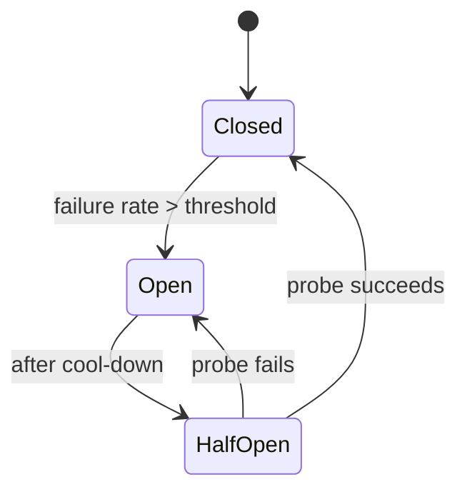

# 02 — Claude API and Application Fundamentals

> **Domain mapping:** feeds Domain 4 (Prompt Engineering & Structured Output, 20%) and Domain 5 (Context
> Management & Reliability, 15%). `stop_reason` handling is explicitly called out under Domain 1 (27%).
> **This section is the mechanical foundation for everything after it.** If you are fuzzy on content blocks or
> `stop_reason`, you cannot reason correctly about agents.

---

## 2.1 Claude API architecture **[Claude-specific]**

### 2.1.1 One endpoint

Almost everything you do with Claude goes through a single endpoint:

```
POST /v1/messages
```

Tool use, structured outputs, extended thinking, vision, documents, MCP connections, and server-side tools are
all **parameters of this one endpoint**, not separate APIs. Supporting endpoints exist —
`POST /v1/messages/batches`, `POST /v1/files`, `POST /v1/messages/count_tokens`, `GET /v1/models` — but they
feed into or support the Messages API.

> **Why this matters on the exam.** A distractor that says "call the Tool Use API" or "the Structured Output
> endpoint" is wrong by construction. There is one endpoint.

### 2.1.2 The request

```python
response = client.messages.create(
    model="claude-opus-5",          # required — pin it
    max_tokens=16000,               # required — a hard ceiling the model is unaware of
    system="...",                   # optional: string or list of content blocks
    messages=[...],                 # required: the conversation
    tools=[...],                    # optional: JSON-Schema tool definitions
    tool_choice={"type": "auto"},   # optional
    thinking={"type": "adaptive"},  # optional
    output_config={"effort": "high"},
    stream=False,
)
```

**Render order matters** for prompt caching: the request is assembled as **`tools` → `system` → `messages`**.
Anything you change early invalidates the cache for everything after it (§08.3). Memorise this order.

### 2.1.3 The response

```python
Message(
    id="msg_...",
    type="message",
    role="assistant",
    model="claude-opus-5",
    content=[ ... ],            # a LIST of content blocks, never a bare string
    stop_reason="end_turn",     # why generation stopped — see §2.4
    stop_details=None,          # populated ONLY when stop_reason == "refusal"
    usage=Usage(
        input_tokens=...,
        output_tokens=...,
        cache_creation_input_tokens=...,
        cache_read_input_tokens=...,
    ),
)
```

**`content` is always a list of typed blocks.** Code like `response.content[0].text` is a latent bug: with
thinking enabled, block 0 is a `thinking` block; with tools, it may be a `tool_use` block. Always iterate and
narrow on `block.type`.

```python
text = "".join(b.text for b in response.content if b.type == "text")
```

### 2.1.4 Request/response lifecycle

```
 client                        Anthropic API                     your tools
   │                                │                                 │
   ├── POST /v1/messages ──────────▶│                                 │
   │   (tools, system, messages)    │                                 │
   │                                ├─ tokenise, cache-match prefix   │
   │                                ├─ (optional) thinking            │
   │                                ├─ generate content blocks        │
   │◀── 200 Message ────────────────┤                                 │
   │   stop_reason="tool_use"       │                                 │
   │                                │                                 │
   ├── execute tool_use blocks ─────┼────────────────────────────────▶│
   │◀── results ────────────────────┼─────────────────────────────────┤
   │                                │                                 │
   ├── POST /v1/messages ──────────▶│   (history + tool_result blocks)│
   │  ...loop until stop_reason != "tool_use"                         │
```

The API is **stateless**. It holds nothing between calls. Every turn resends the full history. This one fact
drives conversation management (§2.4), context engineering (§08), and prompt caching (§08.3).

---

## 2.2 Message structure and content blocks **[Claude-specific]**

### 2.2.1 Roles

| Role | Who writes it | Notes |
|---|---|---|
| `system` (top-level param) | You | Not a message. A separate top-level field. |
| `user` | You (or your end user) | First message must be `user`. Tool results go here. |
| `assistant` | The model (echoed back by you) | Contains `text`, `thinking`, `tool_use` blocks. |
| `system` (inside `messages[]`) | You, mid-conversation | **[Claude-specific, model-gated]** See §2.3.4. |

Consecutive same-role messages are allowed and are combined into one turn.

### 2.2.2 Content block types

| Block type | Direction | Purpose |
|---|---|---|
| `text` | both | Plain text |
| `image` | → model | `source: {type: "base64"\|"url", media_type, data}` |
| `document` | → model | PDF/text; `source` base64 or `{type:"file", file_id}`; supports `citations` |
| `thinking` | ← model | Extended thinking; echo back unchanged on the same model |
| `tool_use` | ← model | `{id, name, input}` — a *request* to call a tool |
| `tool_result` | → model | `{tool_use_id, content, is_error?}` — must go in a `user` message |
| `server_tool_use` / `*_tool_result` | ← model | Server-side tools (web search, code execution) |
| `compaction` | ← model | **[Claude-specific]** compaction state; must be echoed back |

### 2.2.3 The rules that break systems when violated

1. **Every `tool_use` must be answered by exactly one `tool_result` with the matching `tool_use_id`.**
   A missing or mismatched ID is a 400.
2. **All `tool_result` blocks from one assistant turn go back in a SINGLE `user` message.** Splitting parallel
   results across multiple user messages silently teaches Claude to stop making parallel calls — a quiet
   performance regression, not an error.
3. **A failed tool still returns a `tool_result`, with `is_error: true`.** You do not drop the block, and you do
   not throw to the caller. This is explicitly named in the Domain 2 objectives.
4. **Append `response.content` (the whole list), not just extracted text.** Dropping `thinking`, `tool_use` or
   `compaction` blocks corrupts the conversation state.

```python
# CORRECT: parallel tool results, one user message, error included
tool_results = []
for block in response.content:
    if block.type != "tool_use":
        continue
    try:
        out = dispatch(block.name, block.input)
        tool_results.append({
            "type": "tool_result",
            "tool_use_id": block.id,
            "content": json.dumps(out),
        })
    except ToolError as e:
        tool_results.append({
            "type": "tool_result",
            "tool_use_id": block.id,
            "content": f"Tool failed: {e}. Do not retry with identical arguments.",
            "is_error": True,          # ← structural error flag
        })

messages.append({"role": "assistant", "content": response.content})   # full list
messages.append({"role": "user", "content": tool_results})            # single message
```

---

## 2.3 System prompts **[Claude-specific + Architecture]**

### 2.3.1 What the system prompt is for

The system prompt carries **operator authority**: role, durable behavioural rules, output contract, tool policy,
safety boundaries. The user turn carries **the task and the data**.

| Put in `system` | Put in `user` |
|---|---|
| Persona and scope | The actual question |
| Output format contract | The document to analyse |
| Tool usage policy | Retrieved context |
| Safety and refusal rules | Per-request variables |
| Few-shot examples (if stable) | Anything that changes per request |

### 2.3.2 Instruction hierarchy

Effective precedence, strongest first:

```
1. Harness enforcement       (permission rules, hooks, sandboxes, schema validation)   ← ACTUALLY enforced
2. System prompt             (operator authority)                                      ← strongly followed
3. Mid-conversation system message (operator authority, later in the conversation)
4. User message              (the task)
5. Tool results / retrieved documents / web content                                    ← DATA, never instructions
```

**The critical claim:** levels 2–5 are *behavioural influence*, not enforcement. Only level 1 is a guarantee.
An answer that secures a system purely by writing rules into a prompt is wrong; an answer that pairs a prompt
rule with a deterministic gate is right. This is the same argument Claude Code's own docs make about CLAUDE.md
vs permission settings (§07.5).

### 2.3.3 Organisation and maintainability

Keep the system prompt **structured, versioned, and testable**:

```
<role>...</role>
<capabilities>...</capabilities>
<output_contract>...</output_contract>
<tool_policy>...</tool_policy>
<safety>...</safety>
<examples>...</examples>
```

XML-style tags are a strong convention with Claude — the model handles them reliably as delimiters, and they
make prompts diffable and machine-editable. Store prompts as files in the repo, version them, and gate changes
on an eval suite (§11.7). **A prompt is production code.**

Keep the *stable* parts first and the *volatile* parts last, so caching works (§08.3).

### 2.3.4 Mid-conversation system messages **[Claude-specific, model-gated]**

On **Opus 5, Opus 4.8, Fable 5 and Mythos 5** (not Sonnet 5), you may append a `{"role": "system", ...}` entry
to `messages[]`:

```python
messages = [
    *history,
    {"role": "user", "content": user_message},
    {"role": "system", "content": "Terse mode enabled — keep responses under 40 words."},
]
```

**Why this exists, and why it is the right answer to a specific problem:** editing the top-level `system` field
mid-conversation invalidates the entire cached prefix (it renders before `messages`). A mid-conversation system
message preserves the cache *and* carries operator authority — unlike stuffing the instruction into a user turn,
where it is indistinguishable from user text and therefore injectable.

Constraints: it must follow a `user` message (or an `assistant` message ending in server-tool use), must be
either the last entry or followed by an `assistant` turn, and cannot be `messages[0]`. Unsupported models return
400. On those, fall back to a delimited `<system-reminder>` block inside the user turn.

### 2.3.5 Security considerations

- Never put secrets in the system prompt. It is sent on every request and appears in logs and traces.
- Assume the system prompt is **discoverable**. Do not rely on it staying secret for security.
- Never interpolate untrusted input into the system prompt. That is *direct* prompt injection with operator
  authority — the worst case (§13.2).
- Instructions that must hold under adversarial input belong in code, not prose.

---

## 2.4 Conversation management and `stop_reason` **[Claude-specific — explicitly tested]**

### 2.4.1 The stateless model

The API stores nothing. "Conversation state" is **your** data structure. Consequences:

- You own persistence, retention, and deletion (GDPR/CCPA implications — §13.3).
- You own token growth. History grows monotonically until you intervene.
- You own the session identifier and its mapping to a user/tenant.
- Multi-region or multi-instance deployments need the history in shared storage, not process memory.

```
session_id ──▶ [store] ──▶ messages[]  ──┐
                                          ├─▶ assemble request ─▶ API
system prompt (versioned, from repo) ─────┤
retrieved context (per turn) ─────────────┘
```

### 2.4.2 The six `stop_reason` values

| `stop_reason` | Meaning | What your harness MUST do |
|---|---|---|
| `end_turn` | Claude finished naturally | Return the answer. Terminal. |
| `tool_use` | Claude wants one or more tools | Execute, append `tool_result`s in one user message, call again. **This is the agent loop.** |
| `max_tokens` | Hit your `max_tokens` ceiling | Output is truncated and may be invalid JSON. Raise `max_tokens` and retry, or continue. **Never parse it as if complete.** |
| `stop_sequence` | Hit a custom stop sequence | Handle per your protocol. |
| `pause_turn` | A **server-side** tool loop hit its iteration limit (default 10) | Re-send `[user_query, assistant_response]` to resume. **Do not append "Continue."** — the API detects the trailing `server_tool_use` block. Bound with `max_continuations`. |
| `refusal` | Safety classifier declined | `stop_details` is populated (`type`, `category`, `explanation`). Surface gracefully or use server-side fallbacks. `stop_details` is `null` for every other stop reason — **always guard before reading it**. |

```python
def step(messages, tools):
    r = client.messages.create(model=MODEL, max_tokens=16000,
                               messages=messages, tools=tools)
    if r.stop_reason == "max_tokens":
        raise Truncated("increase max_tokens or stream")
    if r.stop_reason == "refusal":
        return handle_refusal(r.stop_details)      # guard: only set on refusal
    if r.stop_reason == "pause_turn":
        return resume(messages, r)                 # no extra user message
    if r.stop_reason == "tool_use":
        return run_tools_and_continue(messages, r)
    return final(r)                                # end_turn / stop_sequence
```

> **Exam framing:** Domain 1 says "*how `stop_reason` drives the agentic loop*". If a question shows a loop that
> checks only `stop_reason == "tool_use"` and otherwise returns, look for the missing `max_tokens` or
> `pause_turn` handling — that is usually the defect.

### 2.4.3 Growth control: four strategies

| Strategy | Mechanism | Keeps | Loses | When |
|---|---|---|---|---|
| **Truncation (sliding window)** | Keep the last N turns | Recency | Everything older, abruptly | Simple chat; cheap; risky for agents |
| **Summarisation / compaction** | Replace old turns with a summary | Gist, decisions | Detail, exact quotes | Long conversations; the default for agents |
| **Context editing (pruning)** | *Delete* stale tool results / thinking blocks | Structure, recent results | Old tool outputs entirely | Long tool-heavy agent runs |
| **External state** | Write facts to a store; retrieve on demand | Everything, durably | Nothing (but adds a retrieval step) | Cross-session memory; the most scalable |

**[Claude-specific] Server-side compaction** (beta `compact-2026-01-12`, on Fable 5 / Opus 5 / 4.8 / 4.7 / 4.6 /
Sonnet 5 / Sonnet 4.6): the API summarises earlier context itself when the conversation approaches a trigger
threshold (default ~150K tokens).

```python
response = client.beta.messages.create(
    betas=["compact-2026-01-12"],
    model="claude-opus-5", max_tokens=16000,
    messages=messages,
    context_management={"edits": [{"type": "compact_20260112"}]},
)
messages.append({"role": "assistant", "content": response.content})   # ← CRITICAL
```

**The single most common bug:** appending only the extracted text. The response contains a `compaction` block
that the API needs on the next request to replace the compacted history. Extract the text for display, but
**append the full `content` list** to your message array. Losing it silently discards the compaction state.

**[Claude-specific] Context editing** (beta `context-management-2025-06-27`) *prunes* rather than summarises:

```python
context_management={"edits": [
    {"type": "clear_tool_uses_20250919", "clear_tool_inputs": True},
    {"type": "clear_thinking_20251015"},
]}
```

Do not confuse the two. **Editing clears; compaction summarises.** They are different beta headers and different
strategy types, and long-running agents commonly use both plus external memory (§08.3).

### 2.4.4 Session identifiers, persistence, and resumption

For anything long-running, persist a **structured session record**, not just a message array:

```json
{
  "session_id": "sess_01H...",
  "tenant_id": "acme",
  "user_id": "u_42",
  "prompt_version": "support-agent@3.2.1",
  "model": "claude-opus-5",
  "messages": [ ... ],
  "task_state": { "goal": "...", "completed_steps": [...], "open_questions": [...] },
  "budget": { "tokens_used": 184320, "tool_calls": 22, "usd_spent": 1.41 },
  "created_at": "...", "updated_at": "..."
}
```

Why the extra fields:

- `prompt_version` + `model` let you **reproduce** a session and know whether a behaviour change was yours.
- `task_state` is the **structured handoff package** (Domain 1) — it survives compaction because it lives
  outside the transcript, and it lets a *different* agent or a *new* session resume the work coherently.
- `budget` enforces termination limits (§09.9) across resumptions, not just within one loop.

**Context reconstruction on resume** = system prompt (from repo, current version) + `task_state` rendered as
text + a bounded tail of recent messages + freshly retrieved context. Do **not** naively replay a 3-day-old
transcript: it is expensive, stale, and full of resolved detail.

---

## 2.5 Streaming **[Claude-specific]**

### 2.5.1 Why it matters

Two independent reasons, and candidates usually only know the first:

1. **Perceived latency.** Time-to-first-token, not total time, is what a user feels.
2. **Avoiding HTTP timeouts.** Long generations exceed default request timeouts. The SDKs **require** streaming
   for large `max_tokens` (the 128K output ceiling on current models is unusable without it). If a request may
   involve long input, long output, or a high `max_tokens`, stream it.

### 2.5.2 Shape

```python
with client.messages.stream(
    model="claude-opus-5", max_tokens=64000, messages=messages, tools=tools,
) as stream:
    for event in stream:
        ...                       # message_start, content_block_start,
                                  # content_block_delta, content_block_stop,
                                  # message_delta (carries stop_reason), message_stop
    final = stream.get_final_message()   # assembled Message, same shape as non-streaming
```

Use `get_final_message()` / `finalMessage()` when you do not need per-event handling — do not hand-roll a
Promise around `.on()` handlers.

### 2.5.3 Tool-call streaming

Tool inputs stream as partial JSON deltas. **You cannot execute a tool from a partial input** — wait for
`content_block_stop`. You *may* use the partial stream for UI ("Searching orders…").

**[Claude-specific]** `eager_input_streaming: true` on a tool definition streams tool inputs earlier. It is
**not** a beta feature — use the regular `client.messages.stream(...)`, no beta header.

### 2.5.4 Error handling, reconnection, backpressure

- **Mid-stream failure.** A stream can fail *after* you have shown the user partial text. Decide the product
  behaviour up front: discard and retry (clean but jarring), or keep and mark incomplete. Retrying re-bills the
  input tokens.
- **Reconnection.** The Messages API stream is not resumable — a dropped connection means a new request. If you
  proxy streams to browsers, hold the assembled state server-side so a browser reconnect replays from your
  buffer rather than re-calling Claude.
- **Backpressure.** If your consumer is slower than the stream (a slow WebSocket client), buffer server-side
  with a bounded queue and a drop/close policy. Do not let a slow client hold an upstream connection open.
- **Streaming + structured outputs** work together; streaming + citations work; but you still cannot combine
  citations with `output_config.format`.

---

## 2.6 API reliability **[Claude-specific + Architecture]**

### 2.6.1 Error taxonomy

| HTTP | Type | Retryable? | Action |
|---|---|---|---|
| 400 | `invalid_request_error` | **No** | Fix the request. Retrying burns budget and hides the bug. |
| 401 | `authentication_error` | No | Credentials. |
| 403 | `permission_error` | No | Scope/workspace. |
| 404 | `not_found_error` | No | Bad model ID or resource. |
| 413 | request too large | No | Reduce context. |
| 429 | `rate_limit_error` | **Yes** | Honour `retry-after`; back off. |
| 500 / 529 | `api_error` / `overloaded_error` | **Yes** | Backoff + jitter; consider fallback. |
| — | connection/timeout | **Yes** | Backoff; beware duplicate side effects. |

Catch a **chain of specific exception types**, not one broad class — otherwise you cannot tell retryable from
non-retryable:

```python
from anthropic import (NotFoundError, RateLimitError, APIStatusError, APIConnectionError)

try:
    r = client.messages.create(...)
except NotFoundError:        # 404 — config bug, do not retry
    raise
except RateLimitError as e:  # 429 — retry with backoff, honour retry-after
    schedule_retry(e)
except APIStatusError as e:  # other 4xx/5xx — branch on e.status
    handle(e)
except APIConnectionError:   # network — retry
    schedule_retry()
```

### 2.6.2 Timeouts and retries

- SDK defaults: **timeout 10 minutes**, **max_retries 2** (covering 408/409/429/5xx and connection errors).
- **Units differ by SDK**: Python/Ruby seconds, TypeScript **milliseconds**, Go `time.Duration`, Java
  `Duration`, C# `TimeSpan`. A "timeout: 30" meant as seconds is 30 ms in TypeScript.
- **Timeouts are retried**, so worst-case wall clock is `timeout × (max_retries + 1)`. Budget for that in your
  own upstream timeout, or you will get cascading timeouts.
- Set a **per-request** timeout for interactive paths: `client.with_options(timeout=20.0).messages.create(...)`.

### 2.6.3 Exponential backoff with jitter

```python
delay = min(cap, base * 2 ** attempt)
sleep(random.uniform(0, delay))      # full jitter — prevents synchronised retry storms
```

Without jitter, every client that got a 429 at the same moment retries at the same moment. **Jitter is not
optional in a fleet.**

### 2.6.4 Idempotency

The API call itself is safe to retry — it has no side effects. **Your tools are not.** The dangerous case is a
timeout *after* the model requested `create_refund` and *after* your tool executed but before you recorded it.

Design rule: **every side-effecting tool takes a caller-supplied idempotency key** derived from the
`tool_use_id`:

```python
def create_refund(order_id: str, amount_cents: int, *, idempotency_key: str):
    # idempotency_key = tool_use_id — stable across retries of the same tool call
    ...
```

This converts at-least-once delivery into effectively-once execution, which is the only way to make an agent
with write access safely retryable (§13.4, §09.10).

### 2.6.5 Circuit breakers and graceful degradation



When the breaker is open, do not queue unbounded work — **degrade**:

| Degradation | Example |
|---|---|
| Fallback model / tier | Opus → Sonnet |
| Fallback provider / region | Claude API → Bedrock (note: feature parity differs) |
| Cached or templated response | "Here are the top articles for this topic" |
| Deterministic path | Keyword search instead of RAG |
| Human fallback | Route to a support queue |
| Honest failure | "Try again in a few minutes" — better than a wrong answer |

**Partial failure in agents** is its own class: 3 of 5 parallel tools succeeded. Return all 5 `tool_result`
blocks, the failures with `is_error: true`, and let the model decide whether it can proceed. Do **not** abort the
whole turn — the model is often able to continue with partial evidence, and telling it what failed is more
useful than hiding it.

### 2.6.6 Rate limits and throughput

Limits apply to requests/minute and tokens/minute (input and output tracked separately). Architecture:

- **Queue** at the edge; never let user traffic hit the API unshaped.
- **Token-bucket client-side limiter** sized below your actual quota so bursts are absorbed by you, not by 429s.
- **Segregate tiers**: interactive traffic and batch traffic must not share a bucket, or a backfill will
  starve users.
- **Batch API** for non-interactive work: asynchronous, **50% cost**, results returned in **any order** — key by
  `custom_id`, never by position.
- **[Claude-specific]** Priority Tier exists for guaranteed throughput but **does not cover Opus 5 / Sonnet 5 /
  Mythos 5**; a Priority Tier request naming one of those fails validation. Fast mode (Opus 5 / Opus 4.8,
  research preview) has its own separate rate limit.

---

## Key takeaways

- One endpoint: `POST /v1/messages`. Render order `tools → system → messages`.
- `content` is a list of typed blocks. Always append the **whole list** back to history.
- Six `stop_reason` values; `tool_use` is the agent loop, `pause_turn` resumes without an extra user message,
  `max_tokens` means the output is truncated, `refusal` is the only one that populates `stop_details`.
- Failed tools return `tool_result` with `is_error: true` — they are not exceptions.
- The API is stateless: you own history, growth control, persistence and reconstruction.
- 400 is never retryable; 429/5xx are, with exponential backoff **and jitter**. Idempotency keys make
  side-effecting tools safe to retry.

## Things to memorise

- The six `stop_reason` values and the required harness action for each.
- "All parallel `tool_result`s in one `user` message."
- Compaction = summarise (`compact_20260112`); context editing = prune (`clear_tool_uses_20250919`).
- SDK timeout units differ; TypeScript is milliseconds.
- Batch API = 50% cost, results in any order, key by `custom_id`.

## Common mistakes

- `response.content[0].text` (breaks with thinking or tools).
- Appending only text instead of the full content list (loses `thinking` / `compaction` / `tool_use`).
- Splitting parallel tool results across multiple user messages.
- Retrying 400s.
- Reading `stop_details` without checking `stop_reason == "refusal"`.
- Sending "Continue." after `pause_turn`.

---

## Scenario questions

**Q1.** An agent occasionally returns malformed JSON. Logs show `stop_reason: "max_tokens"` on exactly those
requests. An engineer adds a JSON-repair library. Critique.

<details><summary>Answer</summary>

The repair library treats the symptom and will silently produce *plausible but wrong* objects — the output is
truncated, so fields are missing, not malformed. Correct fixes, in order: (1) branch on
`stop_reason == "max_tokens"` and treat it as a hard failure rather than parsing it; (2) raise `max_tokens` and
switch to streaming (required for large ceilings); (3) reduce output size — ask for fewer fields, or paginate
the extraction; (4) use `output_config.format` so the model is constrained and you get a schema-validated
object. Repairing truncated JSON is a data-integrity hazard: it converts a loud failure into a quiet one.
</details>

**Q2.** A multi-tenant chat service keeps conversation history in process memory keyed by session ID. It runs 6
replicas behind a round-robin load balancer. Users report the assistant "forgetting" mid-conversation. Diagnose
and fix.

<details><summary>Answer</summary>

The API is stateless, so history is entirely client-side — and round-robin sends turn *n+1* to a replica that
never saw turn *n*. Fixes: move history to shared storage (Redis/Postgres/DynamoDB) keyed by session ID with
tenant scoping; or use sticky sessions (fragile — breaks on deploy/scale events). Shared storage is correct.
While you are there: store a structured session record (§2.4.4) including `prompt_version` and `model` so you
can reproduce behaviour, add a retention policy, and enforce tenant isolation at the storage layer so a session
ID from tenant A cannot read tenant B's history.
</details>

**Q3.** An agent calls three tools in parallel. One times out. The engineer returns only the two successful
`tool_result` blocks and omits the third. What happens, and what is correct?

<details><summary>Answer</summary>

The API returns a 400: every `tool_use` must be answered by a `tool_result` with a matching `tool_use_id`.
Correct behaviour is to return **all three** in one `user` message, with the failed one carrying
`is_error: true` and a message that tells the model something actionable ("timed out after 30s; the inventory
service is degraded; you may proceed with the other two results or ask the user to retry"). This is the
`is_error` semantics Domain 2 tests. Two follow-on points: (a) an informative error message materially improves
recovery quality versus a bare `"error"`; (b) if the tool has side effects, pair the retry with an idempotency
key so the timeout does not double-execute.
</details>

**Q4.** A batch pipeline processes 200k documents overnight. It calls the Messages API in a 64-way thread pool,
retrying every non-2xx three times with a fixed 1-second delay. It gets stuck at ~30% throughput with heavy
429s and occasional duplicate DB writes. Redesign.

<details><summary>Answer</summary>

Four defects:
1. **Fixed-delay retries with no jitter** → synchronised retry storms that sustain the 429 state. Use
   exponential backoff with full jitter and honour `retry-after`.
2. **Retrying all non-2xx** → 400s are retried three times, wasting quota and masking a real request bug. Branch
   on error type.
3. **No client-side rate limiting** → the pool discovers limits by hitting them. Add a token bucket sized below
   quota, tracking both requests/min and tokens/min.
4. **Duplicate DB writes** → retries re-execute side effects. Add idempotency keys.

Then the architectural change: this workload is non-interactive, so use the **Batch API** — ~50% cost, no
rate-limit fight, and results keyed by `custom_id` (which must be honoured, since results return in arbitrary
order). Keep the synchronous path only for the latency-sensitive minority.
</details>

**Q5.** A team enables server-side compaction. It works for a while, then conversations "reset" — the model
loses all earlier context after ~30 turns. Their code does
`messages.append({"role": "assistant", "content": text_block.text})`. Explain.

<details><summary>Answer</summary>

They are discarding the `compaction` block. Compaction returns state in `response.content` that the API needs on
the following request to substitute for the compacted history. By appending only extracted text, that state is
dropped, so each subsequent request looks like a conversation with no compaction record — and the earlier
history is genuinely gone. Fix: `messages.append({"role": "assistant", "content": response.content})` and
extract text separately for display. This is the documented number-one compaction pitfall, and it generalises:
**never reconstruct assistant turns from extracted text.**
</details>

**Q6.** A trading-desk assistant must never fabricate a price. Rank these controls by strength: (a) a system
prompt saying "never guess prices", (b) `output_config.format` with a `price_source` enum, (c) a tool that is
the only source of prices plus post-hoc validation that any quoted number appears in a tool result.

<details><summary>Answer</summary>

Strength order: **(c) > (b) > (a)**.

- (a) is behavioural influence only — level 2 in the instruction hierarchy. Necessary, never sufficient.
- (b) constrains *shape*, not *truth*: the model can still emit a valid enum value alongside a fabricated
  number. It reduces the failure surface but does not close it.
- (c) is enforcement: prices can only enter the conversation through a tool result, and a deterministic
  post-check rejects any response containing a number not present in a tool result. That is a *verifiable
  invariant* in code.

The production answer combines all three, but if forced to choose one, choose the one enforced outside the
model. This is the general exam heuristic: **prefer the control that a deterministic component enforces.**
</details>
