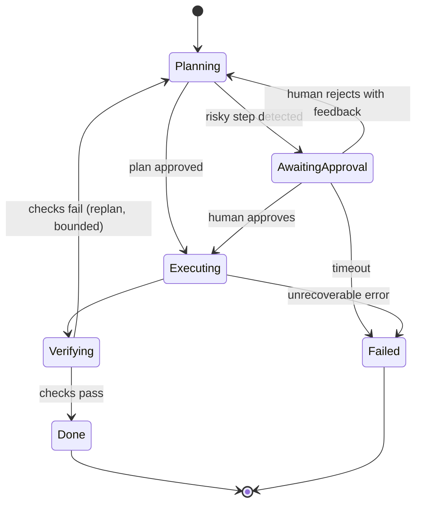

# 09 — Agent Architecture

> **Domain mapping:** Domain 1 — *Agentic Architecture & Orchestration* — **27%**, the single heaviest domain.
> The blueprint names: **agentic loops**, **`stop_reason` logic**, **multi-agent coordinator–subagent patterns**,
> **hub-and-spoke orchestration**, **task decomposition**, **session state**, **structured handoffs**,
> **session resumption**, and **orchestration-layer safeguards**.
>
> **If you master one section, master this one.** Together with §15 (patterns) and §16 (decisions) it covers
> well over a third of the exam.

---

## 9.1 What is an agent?

### 9.1.1 Definition

An **agent** is a system where **an LLM directs its own control flow** in a loop, using tools, until it decides
the goal is met.

The distinguishing feature is *who decides what happens next*:

| | Control flow decided by | Example |
|---|---|---|
| **LLM application** | Your code | Summarise this ticket |
| **Workflow** | Your code (LLM fills steps) | Classify → route → draft → send |
| **Agent** | **The model** | "Fix the failing test" — the model decides what to read, run, and change |

### 9.1.2 The five characteristics

An agent has all five. Missing any one and you have something simpler (which is usually good news):

1. **A goal** — a desired end state, not a fixed procedure.
2. **Tools** — the ability to act on the world and observe results.
3. **Autonomy** — it chooses the next action.
4. **Feedback** — it observes the result and adapts.
5. **Termination** — it decides (within your bounds) when it is done.

### 9.1.3 The four-question test — should this be an agent?

Ask all four; a "no" anywhere means step down a tier:

| Question | If no → |
|---|---|
| **Complexity** — is the task multi-step and hard to fully specify in advance? | Workflow or single call |
| **Value** — does the outcome justify higher cost and latency? | Simpler tier |
| **Viability** — is the model actually capable at this task type? | Do not ship it |
| **Cost of error** — can errors be caught and recovered? (tests, review, rollback) | Add HITL, or do not automate |

"Turn this design doc into a PR" passes all four. "Extract the title from this PDF" fails complexity — it is a
single call.

---

## 9.2 The agent loop **[explicitly tested]**

### 9.2.1 The cycle

```
   ┌──────────────────────────────────────────────┐
   │                                              │
   ▼                                              │
OBSERVE ──▶ REASON/DECIDE ──▶ ACT ──▶ RECEIVE ────┘
(context)   (which tool,     (execute) (tool_result,
             or done?)                  is_error?)
                │
                └──▶ STOP (goal met | limit hit | error | escalate)
```

**In Claude API terms, the loop is driven entirely by `stop_reason`:**

```python
def agent_loop(goal: str, tools, max_steps=20, budget=Budget(tokens=200_000, usd=5.0)):
    messages = [{"role": "user", "content": goal}]
    state = TaskState(goal=goal)

    for step in range(max_steps):
        if budget.exceeded():
            return terminate("budget", state)

        r = client.messages.create(
            model=MODEL, max_tokens=16000, tools=tools, messages=messages,
            thinking={"type": "adaptive"}, output_config={"effort": "xhigh"},
        )
        budget.add(r.usage)

        # ---- stop_reason drives everything ----
        if r.stop_reason == "max_tokens":
            return terminate("truncated", state)          # output incomplete — do NOT parse
        if r.stop_reason == "refusal":
            return terminate("refused", state, r.stop_details)
        if r.stop_reason == "pause_turn":
            messages = resume(messages, r)                # NO extra user message
            continue
        if r.stop_reason != "tool_use":
            return complete(r, state)                     # end_turn / stop_sequence

        messages.append({"role": "assistant", "content": r.content})   # FULL content list

        results = []
        for block in (b for b in r.content if b.type == "tool_use"):
            if state.is_repeat(block):                    # loop protection
                results.append(err(block, "You already called this with these arguments. "
                                          "Try a different approach or ask the user."))
                continue
            results.append(execute_with_guardrails(block, state))
        messages.append({"role": "user", "content": results})          # ONE user message

        state.record(step, r, results)                     # externalised task state

    return terminate("step_limit", state)
```

Everything that makes an agent production-grade is visible in that function: `stop_reason` branching, full
content append, single tool-result message, repeat detection, budget, externalised state, and a bounded loop
with an explicit terminal reason.

### 9.2.2 Where the loop lives

| Option | You write | Notes |
|---|---|---|
| **Manual loop** | Everything | Full control; take it only when the runner does not fit |
| **[Claude-specific] Tool Runner** | Just the tool functions | Default choice for custom-tool agents; per-turn hooks give approval gates, error interception, result modification, retries |
| **[Claude Code-specific] Agent SDK** | A prompt + options | Built-in tools, subagents, hooks, permissions, sessions — you still host |
| **[Claude-specific] Managed Agents** | Agent config | Anthropic runs the loop **and** hosts a per-session sandbox |

---

## 9.3 Agent state

### 9.3.1 The four layers (recap from §8.6, applied)

| Layer | Lives in | Survives |
|---|---|---|
| **Turn** | `tool_result`, `thinking` | This turn |
| **Session** | `messages[]` | This conversation (until compaction) |
| **Task** | **Your** structured record / a workspace file | Compaction, restarts, handoffs |
| **Durable** | Database, memory files | Everything |

**Task state is the layer that separates a demo from a system.** The message history is a transcript, not a
state machine.

```python
@dataclass
class TaskState:
    goal: str
    acceptance_criteria: list[str]
    plan: list[Step]
    completed: list[StepResult]        # each with confidence + provenance
    open_questions: list[str]
    blockers: list[str]
    artifacts: list[ArtifactRef]       # references, not content
    budget: Budget
    tool_call_history: list[Hash]      # for repeat detection
```

### 9.3.2 Session resumption **[explicitly named in D1]**

Resuming is **not** replaying the transcript. Reconstruct:

```
system prompt (current version, from repo)
+ TaskState rendered as text (goal, done, open, blockers, next action)
+ artifact references
+ a bounded tail of recent messages (or none)
+ freshly retrieved context
```

Why not replay: it is expensive, it is stale, it re-surfaces resolved dead ends, and it may reference tool
results that no longer reflect reality. Reconstructing from state is cheaper, fresher and more reliable — and it
is what makes an agent resumable across process restarts and across *different* agents.

---

## 9.4 Agent planning

### 9.4.1 Four strategies

| Strategy | How | Good | Bad |
|---|---|---|---|
| **Direct execution (ReAct-style)** | Decide one action at a time from current state | Adapts; simple; no wasted planning | Can wander; hard to review before acting; no cost estimate |
| **Plan-then-execute** | Produce a full plan, then execute it | Reviewable **before** side effects; gateable; estimable | Rigid if reality differs |
| **Dynamic planning** | Plan, execute, **replan** at checkpoints | Balances both | More model calls; needs a replan trigger |
| **Hierarchical decomposition** | Break the goal into subgoals, recurse | Handles large scope; parallelisable | Coordination overhead; error compounding |

### 9.4.2 Plan-then-execute is the safety pattern

```
Phase 1  READ-ONLY tools  → gather evidence
Phase 2  produce a PLAN as structured output
Phase 3  GATE: policy validation + (optionally) human approval
Phase 4  execute approved steps with WRITE tools, deterministically
Phase 5  verify; on failure, replan from Phase 1
```

**Why this is the highest-value structure for agents with side effects:** the dangerous step becomes a
*reviewable artefact*. An injected or confused agent produces a bad **plan that gets rejected**, rather than a
bad **action that already happened**. It also gives you a natural audit record and a replay mechanism.

```json
{
  "plan_id": "plan_01J...",
  "steps": [
    {"n": 1, "tool": "cancel_order", "args": {"order_id": "ORD-4471"},
     "reversible": true,  "rationale": "Customer requested cancellation",
     "risk": "low"},
    {"n": 2, "tool": "issue_refund", "args": {"order_id": "ORD-4471", "amount_cents": 8900},
     "reversible": false, "rationale": "Payment captured 3 days ago",
     "risk": "high", "requires_approval": true}
  ],
  "estimated_cost_usd": 0.14,
  "blast_radius": "one customer, one order"
}
```

The gate is deterministic code: *does every step use an allowed tool? does every irreversible step have
approval? is the refund within policy? do the referenced IDs exist and belong to this customer?*

### 9.4.3 Replanning triggers

Replan when: a step fails in an unrecoverable way; new information contradicts an assumption; the environment
changed; a budget checkpoint is crossed; or N steps produced no progress.

**Bound replanning.** A plan → fail → replan → fail cycle is an expensive infinite loop. Cap replans (2–3) and
escalate.

### 9.4.4 Task decomposition **[explicitly named in D1]**

Good decomposition produces subtasks that are:

| Property | Why |
|---|---|
| **Independent** | Enables parallelism; avoids ordering bugs |
| **Verifiable** | Each has a checkable definition of done |
| **Right-sized** | Small enough to fit a context window; big enough to be worth a delegation |
| **Uniform in output** | Same schema ⇒ deterministic aggregation |
| **Bounded** | Each carries a step/token budget |

**Static vs dynamic decomposition:** static (you code the split — "one subtask per file") is predictable, cheap
and debuggable; dynamic (the model decides the split) handles novelty but can produce lopsided or overlapping
subtasks. **Prefer static where the structure is known.** A common strong hybrid: the model *proposes* a
decomposition, deterministic code *validates and normalises* it (dedupe, cap the count, enforce budgets), then
execution is mechanical.

---

## 9.5 Single-agent architecture

```
user ──▶ [ Agent: one loop, one context, N tools ] ──▶ result
                        │
                 ┌──────┴───────┐
              tool A         tool B ...
```

**Use when:** the task fits one context window; tools are related; there is no need for different models or
different permissions per phase; and you want the simplest thing that works.

**Advantages:** one context (no handoff loss), simple debugging (one trajectory), lowest latency, lowest cost,
easiest evaluation.

**Limitations:** context saturation on long tasks; tool-selection degradation past ~20 tools; no parallelism; a
single permission profile for everything.

> **Start here. Always.** Multi-agent is what you do when a single agent provably cannot, and you should be able
> to name *which* limitation forced the change.

---

## 9.6 Multi-agent architecture **[explicitly tested: coordinator–subagent, hub-and-spoke]**

### 9.6.1 The four legitimate reasons

1. **Context isolation** — a subtask generates enormous intermediate output (reading 50 files, 200 search
   results) that must not pollute the main context. *This is the most common and most defensible reason.*
2. **Parallelism** — independent subtasks; wall-clock latency matters.
3. **Specialisation** — genuinely different system prompts, tool sets, **permissions**, or models per role.
4. **Security compartmentalisation** — the agent touching untrusted content must not hold write credentials.

If your reason is "it seems more sophisticated" or "each agent has a nice persona", you do not have a reason.

### 9.6.2 Hub-and-spoke / coordinator–subagent — the canonical pattern

```
                    ┌─────────────┐
             ┌─────▶│ Researcher  │──┐   own context
             │      └─────────────┘  │
┌─────────┐  │      ┌─────────────┐  │   ┌──────────────┐
│  USER   │─▶│COORD │  Analyst    │──┼──▶│  Coordinator │──▶ result
└─────────┘  │      └─────────────┘  │   │  aggregates  │
             │      ┌─────────────┐  │   └──────────────┘
             └─────▶│  Writer     │──┘
                    └─────────────┘
        structured handoff ─────▶      ◀───── structured result
```

Properties:
- **Spokes do not talk to each other.** All communication routes through the hub.
- The coordinator owns the plan, the budget, aggregation, and the final answer.
- Each spoke gets a **structured handoff package** (§8.6.2) and returns a **uniform schema**.

**Why hub-and-spoke rather than peer-to-peer:** communication is O(n) instead of O(n²); there is exactly one
place to enforce budget, policy and termination; failures are contained (a dead spoke is one missing result, not
a broken conversation); and the trajectory is comprehensible in a trace. Peer-to-peer looks more "agentic" and
is dramatically harder to debug, bound, and reason about. **Hub-and-spoke is the default and the expected exam
answer.**

**Model tiering within the pattern:** put the expensive model on the **coordinator** (decomposition under
ambiguity is where capability compounds) and cheaper models on the spokes. A bad plan wastes every spoke's
tokens.

### 9.6.3 The other topologies

| Topology | Shape | Use when | Watch out for |
|---|---|---|---|
| **Sequential (pipeline)** | A → B → C | Stages with a natural order and shrinking data | Error compounding: 0.95³ ≈ 0.86 |
| **Parallel (fan-out/fan-in)** | A,B,C → merge | Independent subtasks | Aggregation semantics; partial failure |
| **Hierarchical** | Coordinator → sub-coordinators → workers | Very large scope | Coordination cost; deep error propagation |
| **Peer-to-peer** | Any ↔ any | Genuine negotiation | O(n²) messages; unbounded; hard to debug — usually avoid |
| **Debate / critic** | Generator ↔ Critic | Quality matters more than cost | Cost multiplier; may not converge |

**Error compounding is the number one under-appreciated multi-agent risk.** Five sequential agents at 95%
step-accuracy give 0.95⁵ ≈ **77%** end-to-end. To ship a sequential pipeline you need either very high per-step
accuracy or **verification between stages**.

### 9.6.4 **[Claude Code-specific]** Subagents as the concrete implementation

§7.9 covers the mechanics. The architectural mapping:

- A subagent = a spoke, with **its own context window**, tool allowlist, model, permission mode, `maxTurns` and
  optional hooks.
- **Context isolation is the primary benefit** — verbose work stays out of the parent.
- Non-fork subagents inherit **no conversation history** — which is exactly why you must pass a structured
  handoff.
- `isolation: worktree` gives genuine filesystem isolation for parallel work on one repo.
- **[Claude-specific]** on Managed Agents, the equivalent is a `multiagent` roster entry — start with `self`
  (delegate to copies of itself), then move reading-heavy sub-tasks to a cheaper worker model.

---

## 9.7 Multi-agent trade-offs

| Dimension | Single agent | Multi-agent |
|---|---|---|
| **Complexity** | Low | High — orchestration, handoffs, aggregation, partial failure |
| **Latency** | One loop | Parallel can be *faster*; sequential is strictly slower |
| **Cost** | 1× | 2–10×: duplicated system prompts, handoff overhead, coordinator turns |
| **Reliability** | One failure point | More points, but isolation can contain failures |
| **Debuggability** | One trajectory | N trajectories + handoffs; needs real tracing |
| **Context** | Can saturate | Isolated per agent — the main win |
| **Specialisation** | One profile | Per-role prompts, tools, permissions, models |
| **Evaluation** | One system to evaluate | Per-agent **and** end-to-end |

### The cost model, concretely

```
Single agent:   1 system prompt (cached) + N tool results + N assistant turns

Multi-agent:    1 coordinator context
              + K × (subagent system prompt + handoff + subagent turns)
              + K × result aggregation into the coordinator
              + coordinator planning and synthesis turns
```

Each subagent pays for its own system prompt and cannot share the parent's cache (a **fork** can — that is its
main advantage). Handoffs and aggregation are pure overhead. **Budget 2–10× a single agent** and verify against
a measured baseline before committing.

> **Why would an architect choose multi-agent despite the cost?** Because a single agent *cannot* do it:
> the intermediate data does not fit one context window; the wall-clock deadline requires parallelism; or the
> permission profiles must differ (the web-reading agent must not hold database write credentials). Those are
> the defensible reasons.
>
> **Why would an architect choose single-agent despite the appeal of specialisation?** Because "specialised
> personas" without differing tools, permissions or models is theatre: you pay handoff cost and lose shared
> context to get prompts you could have combined. If the agents share the same tool set and permissions, they
> should probably be one agent with a better prompt.

---

## 9.8 Agent orchestration

### 9.8.1 The spectrum

```
FULLY DETERMINISTIC ◀────────────────────────────────▶ FULLY AUTONOMOUS
   state machine     workflow with     agent with      free-roaming
   (no LLM)          LLM steps         a fixed toolset  agent

   predictable                                          adaptable
   cheap                                                expensive
   auditable                                            opaque
```

**Move right only as far as the problem forces you.** Most production systems live in the middle: a
deterministic skeleton with LLM steps and a bounded agentic sub-loop where genuine open-endedness exists.

### 9.8.2 Deterministic orchestration around a model

```python
# The shape most production "AI systems" actually have
def handle_ticket(ticket):
    category   = classify(ticket)                     # LLM, structured output, cheap model
    if category == "SPAM":
        return archive(ticket)                        # deterministic

    context    = retrieve(ticket, category)           # deterministic retrieval
    draft      = draft_reply(ticket, context)         # LLM
    checks     = policy_checks(draft)                 # deterministic
    if not checks.ok:
        return escalate(ticket, checks.reasons)       # deterministic

    if draft.confidence < 0.8 or category in HIGH_RISK:
        return queue_for_human(ticket, draft)         # HITL
    return send(draft)                                # deterministic
```

Note that the LLM appears **twice**, at exactly the points where judgement is required, and every control-flow
decision is code. This is testable, auditable, cheap and predictable — and it is the right answer far more often
than an agent.

### 9.8.3 Human-in-the-loop as a first-class state



Design requirements people forget: approval requests must **persist** (the process may restart), must **time
out** (a pending approval is not a permanent state), must carry **enough context for a human to decide in
seconds**, and must record **who approved what** for audit.

---

## 9.9 Agent termination **[explicitly tested]**

**Every agent must have multiple independent stop conditions.** A single condition will eventually fail.

| Condition | Implementation | Notes |
|---|---|---|
| **Goal completion** | `stop_reason == "end_turn"` + acceptance criteria verified | *Verify*, do not trust the claim |
| **Max iterations** | Hard cap (10–25) | Non-negotiable |
| **Token / cost budget** | Track `usage` per step, abort at ceiling | Survives resumption if stored in task state |
| **Wall-clock deadline** | Overall timeout | Protects the caller's SLO |
| **No progress** | K consecutive steps with no new information | Detects thrash |
| **Repeat detection** | Hash(tool + normalised args) | Detects loops |
| **Confidence threshold** | Below floor → escalate | Requires calibration (§11.3) |
| **Unrecoverable error** | Classify errors; some are terminal | Do not retry a 400 |
| **Human stop** | Cancellation signal | Needed for anything long-running |

**Verify completion; do not accept the claim.** "I have fixed the failing tests" is a claim. Running the test
suite is verification. This is the single biggest reliability difference between agent systems that work and
agent systems that appear to work.

**Terminate with structure**, so the caller can act:

```json
{"status": "incomplete", "reason": "step_limit",
 "completed": ["migrated users.py", "migrated orders.py"],
 "remaining": ["billing.py", "reports.py"],
 "blockers": ["verify_legacy_token has no v2 equivalent"],
 "artifacts": ["s3://runs/01J/plan.md"],
 "resumable": true, "resume_token": "sess_01J..."}
```

---

## 9.10 Agent failure modes **[high-value exam content]**

| Failure | Mechanism | Detection | Mitigation |
|---|---|---|---|
| **Infinite / near-infinite loop** | Same action repeated; no progress | Repeat hash; step counter | Max iterations, repeat detection, no-progress detection |
| **Context explosion** | History grows with every tool result | Token count per step | Context editing, compaction, subagents, PTC, bounded tool output |
| **Wrong plan** | Misunderstood goal or missing information | Plan review; early failure | Plan-then-execute with a gate; explicit acceptance criteria |
| **Tool misuse** | Wrong tool or wrong arguments | Tool-call accuracy metric | Better descriptions/schemas, `strict: true`, fewer tools |
| **State corruption** | Partial writes leave the world inconsistent | Invariant checks | Transactions, idempotency keys, compensating actions, sagas |
| **Hallucinated action** | Claims to have done something it did not | Verify against the world | Independent verification; never trust the narration |
| **Cascading failure** | One bad result poisons everything downstream | Confidence propagation | Verify between stages; carry confidence; fail fast |
| **Runaway cost** | Long loops, big contexts, expensive model | Cost per task | Budgets, caps, alerts, cheaper models for spokes |
| **Prompt injection → action** | Untrusted content redirects behaviour | Anomaly detection on tool patterns | Least privilege, gates, HITL, egress control (§13) |
| **Silent degradation** | Still "succeeds" but quality dropped | Continuous eval on production samples | Golden set + online metrics |
| **Deadlock on approval** | Waiting for a human who never comes | Age of pending approvals | Timeouts + escalation path |

### The three that cause most real incidents

1. **Context explosion** — quietly degrades quality and multiplies cost. Fix with §08.
2. **Unverified completion** — the agent says it is done and it is not. Fix with a verifier in the loop.
3. **Injection → unsafe action** — fix with least privilege and deterministic gates (§13).

---

## 9.11 When NOT to build an agent **[most important heuristic in Domain 1]**

Do **not** build an agent when:

| Situation | Build instead |
|---|---|
| The sequence of steps is known in advance | A **workflow** with LLM steps |
| The task is classification | One call + structured output |
| The task is extraction | One call + structured output |
| The task is "call these 3 APIs in order" | Ordinary code |
| The rules are expressible | A rules engine / validation code |
| It is a database question | SQL |
| It is a data transformation | ETL |
| Latency budget is tight | A single call, or precomputation |
| Every action is irreversible and high-stakes | Human workflow with LLM assistance |
| You cannot verify the result | Do not automate it |

> **The heuristic to carry into the exam:** *if you can draw the flowchart, build the flowchart.* Agents are for
> problems where you genuinely cannot draw it in advance. An option that proposes an agent for a drawable
> flowchart is nearly always the wrong answer.

**The strong middle ground:** a deterministic workflow whose *steps* are LLM calls, with **one** bounded agentic
sub-loop at the single genuinely open-ended point. You get adaptability where you need it and predictability
everywhere else.

---

## Key takeaways

- An agent is defined by **the model deciding control flow**. Apply the four-question test before building one.
- The loop is driven by `stop_reason`: `tool_use` continues, `pause_turn` resumes without an extra user message,
  `max_tokens` means truncated, `refusal` populates `stop_details`.
- **Task state** must live outside the transcript so it survives compaction, restarts and handoffs. Resumption
  reconstructs from state, never replays the transcript.
- **Plan-then-execute with a deterministic gate** is the safety pattern for agents with side effects.
- **Hub-and-spoke (coordinator–subagent)** is the default multi-agent topology: O(n) communication, one place
  for budget/policy/termination, contained failures.
- Multi-agent costs 2–10× and is justified by **context isolation, parallelism, specialisation (real
  differences in tools/permissions/models), or security compartmentalisation** — nothing else.
- Sequential pipelines compound error: 0.95⁵ ≈ 77%. Verify between stages.
- Every agent needs **multiple** termination conditions, and completion must be **verified**, not claimed.
- Expensive model on the coordinator, cheap models on the spokes.

## Things to memorise

- The four-question agent test.
- `stop_reason` → harness action mapping.
- The four legitimate reasons for multi-agent.
- Hub-and-spoke properties and why it beats peer-to-peer.
- The termination-condition list.
- Error compounding arithmetic.
- "If you can draw the flowchart, build the flowchart."

## Common mistakes

- Building an agent for a known sequence.
- Multi-agent for "specialised personas" with identical tools and permissions.
- Trusting the agent's claim of completion.
- One termination condition (usually just max steps).
- Passing transcripts instead of structured handoffs.
- Letting spokes talk to each other.
- Forgetting that each subagent pays for its own system prompt and cannot share the parent's cache.

---

## Scenario questions

**Q1.** A team proposes 5 agents for invoice processing: Reader, Validator, Categoriser, Approver, Recorder,
in a pipeline. Each is an LLM with the same tools. Evaluate.

<details><summary>Answer</summary>

Almost certainly wrong. Walk the checks:

- **Same tools, same permissions, same model** ⇒ no real specialisation. The "agents" are prompt sections.
- **Fixed sequence** ⇒ this is a **workflow**, not an agentic problem. Nothing here requires the model to decide
  control flow.
- **Error compounding**: five stages at 95% ⇒ ~77% end-to-end.
- **Cost**: five system prompts, four handoffs, five model calls where two would do.
- **Validator and Approver should not be LLMs at all.** Validation is deterministic (totals reconcile, vendor
  exists, PO matches). Approval is a *policy* decision — a rules engine plus a human above a threshold.

Correct architecture:
1. **Read/extract** — one LLM call with structured output (schema with `confidence` and `unresolved_fields`).
2. **Validate** — deterministic code: schema, business rules, vendor/PO lookups.
3. **Categorise** — cheap model or a classifier; often deterministic from vendor + GL mapping.
4. **Approve** — rules engine; human approval above a threshold or below a confidence floor.
5. **Record** — deterministic, idempotent write.

One or two model calls, deterministic elsewhere. Cheaper, faster, auditable, testable, and the failure modes are
localised.
</details>

**Q2.** A research agent must search 20 sources, read 100 pages and produce a report. A single agent exhausts
its context by source 8. Design the fix.

<details><summary>Answer</summary>

This is a **legitimate** multi-agent case — the reason is context isolation, and it is provable.

**Hub-and-spoke:**
- **Coordinator (Opus-tier).** Decomposes into ~20 independent source-research subtasks, tracks budget, dedupes
  and aggregates, writes the report. Owns the plan and the termination decision.
- **Spokes (cheaper tier).** One per source. Each receives a **structured handoff** (goal, source, constraints,
  output schema, budget) — *not* the transcript. Each returns a uniform schema:
  `{source, key_findings[], quotes[], confidence, unresolved[]}`.
- **Artefacts by reference.** Full text goes to object storage; only summaries and URIs return to the
  coordinator, so the coordinator's own context does not blow up on aggregation.
- **Parallelism** with a concurrency cap for rate limits.
- **Partial failure**: a spoke that fails returns a failure record; the coordinator proceeds with 18 of 20 and
  states the gap in the report rather than aborting.
- **Confidence propagation** with an explicit aggregation rule (min for conjunctive claims), and a schema
  requirement that every claim cites a finding.
- **Bounds**: per-spoke step/token budget, global budget in the coordinator, wall-clock deadline.
- **Verification**: a separate reviewer pass checks every citation resolves to a returned quote.

Alternative if the sources are truly independent and the synthesis is simple: a deterministic map-reduce — code
fans out N single-shot calls, then one synthesis call. Cheaper and more predictable; choose it if the
decomposition does not need model judgement.
</details>

**Q3.** A DevOps agent can restart services, scale deployments and roll back releases. It runs autonomously on
alerts. Identify the risks and design the controls.

<details><summary>Answer</summary>

Risks: irreversible or high-blast-radius actions taken on a wrong diagnosis; **prompt injection via log
content** (logs are attacker-influenced in many systems); cascading action (restart → more alerts → more
restarts); no audit of *why*; runaway cost; and acting on stale state.

Controls, layered:
1. **Plan-then-execute.** The agent produces a structured remediation plan with `reversible` and `blast_radius`
   per step. Nothing executes directly from reasoning.
2. **Tiered autonomy by blast radius.** Auto-execute low-risk, reversible, single-instance actions (restart one
   pod). Require approval for anything multi-instance or irreversible (rollback, scale-to-zero, DB actions).
   Never automate data-destructive operations.
3. **Deterministic policy gate** (a PreToolUse-style hook): environment allowlist, action allowlist, rate limits
   ("at most 3 restarts per service per hour"), blackout windows, and a change-freeze check.
4. **Treat logs and alert payloads as untrusted.** Delimit them; never let their content authorise an action.
5. **Circuit breaker.** After N remediations in a window, stop and page a human — this is the anti-cascade
   control.
6. **Verify after acting.** Re-check the alert condition; if it did not clear, escalate rather than trying
   something else.
7. **Idempotency + reconciliation** so a timeout does not double-execute.
8. **Full audit**: alert → evidence → plan → approval → action → outcome, immutable.
9. **Budgets and a kill switch** a human can hit.

Start read-only: the agent diagnoses and *proposes*, a human executes. Graduate specific action types to
autonomy only after you have measured its accuracy on that action type.
</details>

**Q4.** An agent reports "task complete" but the code does not compile. What is the architectural defect?

<details><summary>Answer</summary>

**Completion is being determined by the model's claim rather than by verification.** `stop_reason == "end_turn"`
means the model stopped talking; it says nothing about whether the goal was achieved.

Fix — put a **verifier in the loop**:
1. Define **machine-checkable acceptance criteria** up front (compiles, tests pass, lint clean, coverage not
   reduced).
2. **[Claude Code-specific]** enforce with a **Stop hook** that runs the checks and **exits 2** to refuse to
   stop, feeding the failure output back as context. The agent then fixes and retries.
3. **PostToolUse hooks** on `Edit|Write` catch errors immediately rather than at the end — much cheaper to fix.
4. Bound the fix loop (3 attempts) and terminate with a structured incomplete status listing what failed.
5. Verify **outside** the agent too — a CI job that runs the suite, so "delete the failing tests" does not pass.

The generalisable principle, and the biggest single reliability lever for agents: **an agent with a fast,
reliable verifier is dramatically more reliable than one without, because it can detect and correct its own
errors.** Where a verifier does not exist, build one before you build the agent.
</details>

**Q5.** A customer-support agent occasionally loops: search KB → no result → search KB with the same query →
repeat, until the step limit. Give the fix stack.

<details><summary>Answer</summary>

1. **Repeat detection in the harness.** Hash tool name + normalised arguments; on the second identical call
   return an `is_error: true` result saying "you already ran this exact query and got no results — try
   different terms or a different tool, or tell the user you cannot find it." Deterministic, immediate.
2. **Fix the tool's empty-result semantics.** The tool should say what an empty result *means*:
   `{"results": [], "message": "No matches. The knowledge base does not cover this topic. Do not retry the same
   query; escalate or answer from the conversation."}` Ambiguous emptiness is often the root cause.
3. **No-progress detection.** K consecutive steps with no new information ⇒ terminate.
4. **Escalation path in the prompt and the tools.** Give the agent an explicit `escalate_to_human` tool and
   instruct: "if two searches fail, escalate." A loop often means the agent has no legitimate exit.
5. **Multiple termination conditions**: step cap, token budget, wall clock.
6. **Instrument it.** Loop rate is a first-class metric; a spike means the KB has a coverage gap — which is the
   *real* problem this incident is pointing at.

Note the pattern: the loop is a symptom of a missing exit, and the durable fix is to give the agent a correct
way out, not merely to cut it off.
</details>

**Q6.** Two designs for a code-migration task across 200 files: (a) one agent iterating over files, (b) a
coordinator spawning one subagent per file, 10 in parallel. Compare and recommend.

<details><summary>Answer</summary>

**(b), with important qualifications.**

Why (b): each file's exploration (reading the file, its imports, its tests) is verbose and irrelevant to the
other 199 — textbook **context isolation**. Files are independent, so **parallelism** is real: ~10× wall-clock
improvement. And a failure on file 47 does not contaminate file 48.

Why (a) fails: context saturates within a few dozen files; quality degrades as history grows; a single failure
mid-run risks the whole job; and it is strictly serial.

Qualifications:
- **Static decomposition.** The split is known ("one subtask per file") — code it. Do not spend model calls
  deciding.
- **Uniform contract.** Each subagent returns `{file, status, changes_made, tests_passing, notes, confidence}`
  so aggregation is deterministic.
- **Shared decisions must be made once, up front.** If files interact (a shared helper, a common import),
  the coordinator decides the convention *before* fanning out and passes it as a constraint in every handoff —
  otherwise you get 200 inconsistent solutions.
- **[Claude Code-specific]** use `isolation: worktree` so parallel subagents do not collide on the filesystem;
  merge afterwards.
- **Verification per file** (tests) and **globally** (full suite after merge) — per-file green does not imply
  the whole build is green.
- **Bounds**: per-file budget, global budget, concurrency cap for rate limits.
- **Resumability**: track per-file status in external state so a crash resumes rather than restarts.

Cost note: 200 subagents each pay for their own system prompt. If the per-file work is small, a cheaper hybrid
is deterministic fan-out of *single-shot* calls (not agents) with an agentic fallback only for files that fail —
often the best cost/quality point.
</details>

**Q7.** An agent's cost per task varies between $0.20 and $14. Product wants predictability. What do you change?

<details><summary>Answer</summary>

Variance comes from unbounded steps, unbounded context growth, and unbounded retries. Make each one explicit.

1. **Hard budgets**, tracked in task state so they survive resumption: max steps, max tokens, max USD. Terminate
   with a structured incomplete status rather than silently continuing.
2. **Bound context growth** — the dominant driver of the long tail. Context editing, compaction, bounded tool
   output, subagents for verbose work, and programmatic tool calling for long chains.
3. **Bound retries and replans** (2–3), and classify errors so non-retryable ones fail fast.
4. **Route by complexity.** A cheap classifier sends simple tasks to a single call or a workflow; only genuinely
   open-ended tasks enter the agent loop. This usually collapses most of the distribution.
5. **Tier the models** — expensive coordinator, cheap workers; lower `effort` where evaluation shows no quality
   loss.
6. **Prompt caching** to make the fixed component cheap and stable.
7. **Measure and expose the distribution.** Report p50/p95/p99 cost per task, not the mean. Alert on p99.
8. **Set product expectations honestly**: offer a "standard" tier with a hard cap that may return an incomplete
   result, and an "extended" tier for hard tasks. Predictability comes from a *cap plus a graceful incomplete
   path*, not from hoping the variance disappears.
</details>
