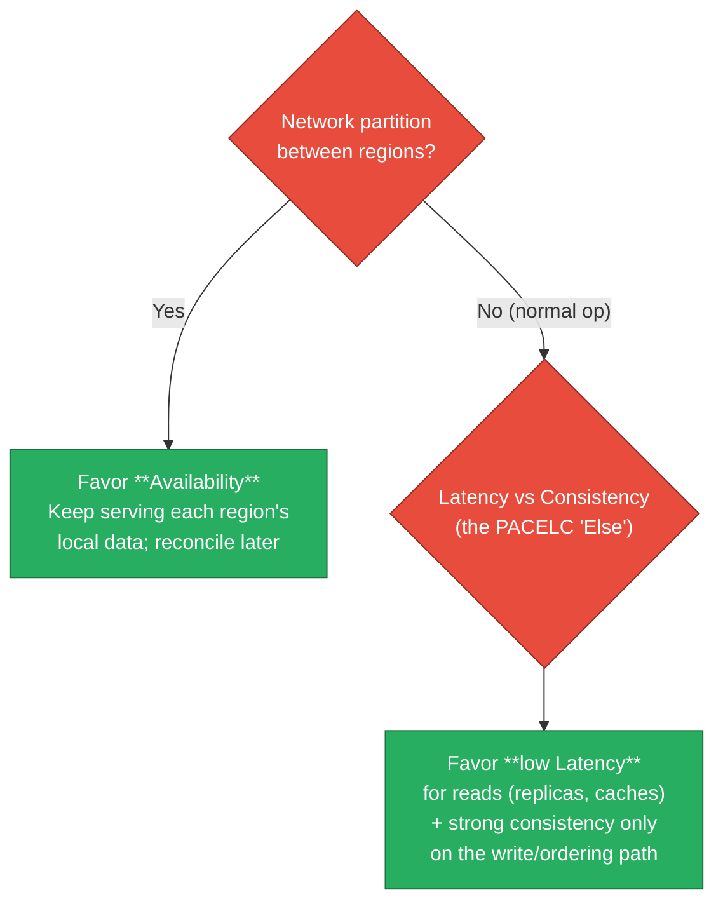
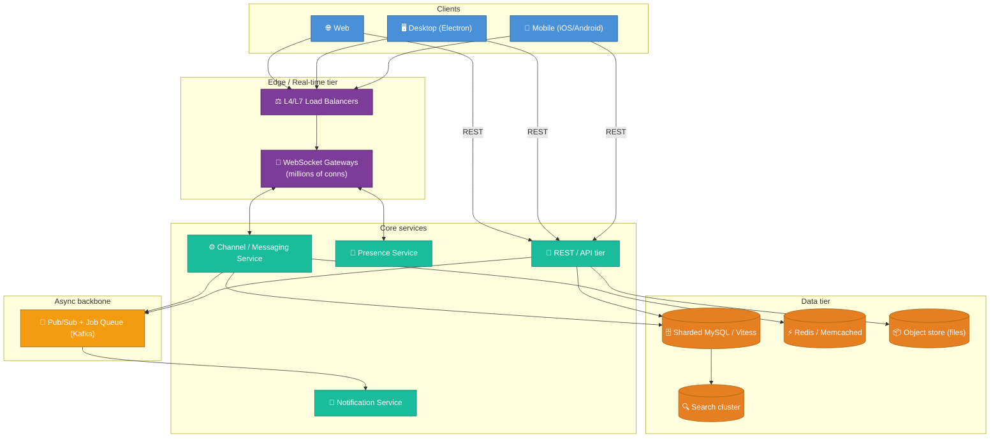

# 01 — Overview & Requirements

Before any architecture, pin down **what we are building**, **at what scale**, and
**what guarantees we are promising**. Skipping this is the most common reason a
design review goes sideways: people argue about Kafka vs. Pulsar before agreeing
on whether messages must survive a datacenter loss.

---

## What Slack actually is

Slack is a **persistent, channel-based team messaging platform** with:

- **Workspaces** (a.k.a. teams) — the top-level tenant. Everything is scoped to a
  workspace. A user account can belong to many workspaces.
- **Channels** — public, private, shared (between workspaces), and DMs/group DMs.
- **Messages** — text, rich formatting, threads, reactions, edits, attachments,
  links with unfurls.
- **Real-time everything** — typing indicators, presence (online/away), read
  state, live message delivery.
- **Search** across all history the user is allowed to see.
- **Files** — upload, preview, share.
- **Integrations** — bots, slash commands, incoming/outgoing webhooks, the Events
  API, OAuth apps.
- **Calls/huuddles** — real-time audio/video (WebRTC) — out of primary scope here
  but noted in the stack.

The mental shorthand: **Slack = IRC's UX + email's durability + Google's search +
an app platform, multiplied by millions of isolated tenants.**

---

## Functional requirements (the "what")

| # | Requirement | Notes |
|---|-------------|-------|
| F1 | Send/receive messages in channels & DMs | Core loop |
| F2 | Real-time delivery to all connected members | The hard part |
| F3 | Durable, ordered, gap-free message history | Survive crashes/restarts |
| F4 | Threads, edits, deletes, reactions | Mutable message state |
| F5 | Presence & typing indicators | High-volume, low-value-per-event |
| F6 | Unread counts & read markers per channel per device | Per-user state |
| F7 | Full-text search over permitted history | Multi-tenant, permission-aware |
| F8 | File upload/download/preview | Object storage + scanning |
| F9 | Cross-device sync (web/desktop/mobile) | Same account, many sessions |
| F10 | Push notifications when offline | Mobile + desktop |
| F11 | Third-party app platform (bots, webhooks, Events API) | Extensibility |
| F12 | Admin/compliance (export, retention, eDiscovery, DLP) | Enterprise table-stakes |

## Non-functional requirements (the "how well") — this is where senior interviews live

| Dimension | Target / stance | Consequence in the design |
|-----------|-----------------|---------------------------|
| **Latency** | Message visible to other members in **&lt; 200 ms p99** intra-region | Push (pub/sub), not poll. Persistent connections. |
| **Durability** | A confirmed message is **never lost** | Synchronous replicated write before ACK |
| **Ordering** | **Per-channel** total order; no global order needed | Sequence numbers per channel, not global clock |
| **Delivery** | **At-least-once** on the wire + client dedupe ⇒ **effectively exactly-once** for the user | Client-generated message IDs, idempotent persist |
| **Availability** | ~**99.99%** for messaging path | Multi-AZ, graceful degradation, cell isolation |
| **Consistency** | **Read-your-writes** for the sender; bounded staleness for others | The sender must see their own message instantly |
| **Tenant isolation** | One workspace cannot see/affect another | Sharding + authz on every read |
| **Scale** | Tens of millions of concurrent connections; some single workspaces have **>1M users** | Fan-out is the dominant cost |
| **Cost** | Persistent connections are expensive; minimize idle cost | Connection multiplexing, efficient presence |

:::tip Interview signal
When asked "what are the requirements," **lead with the non-functional ones and
their consequences.** Anyone can say "users send messages." Saying "we need
per-channel ordering, which lets us avoid a global clock and shard by channel" is
the senior answer.
:::

---

## Where Slack sits on CAP / PACELC



Slack is broadly an **AP-leaning, PACELC = PA/EL** system *for the delivery path*,
but **CP for the per-channel write/ordering path**. Concretely:

- The **write of a message + its sequence number** is consistent (you cannot have
  two messages claim seq #42 in the same channel).
- **Delivery, presence, unreads, search** all tolerate brief staleness and favor
  availability — a presence dot being stale for 5 seconds is fine; losing a
  message is not.

Knowing *which subsystem gets which guarantee* is the whole game. There is no
single CAP answer for "Slack."

---

## Back-of-the-envelope capacity (illustrative numbers)

Let's size a Slack-scale system so later infra choices have grounding. These are
**illustrative**, chosen to be order-of-magnitude realistic.

**Assumptions**

- 50M daily active users (DAU)
- Peak concurrency ~ 12M simultaneous WebSocket connections (work hours overlap)
- Avg user sends ~40 messages/workday
- Avg message + metadata ≈ 1 KB stored

**Message write throughput**

```
50M users × 40 msgs/day = 2.0B messages/day
2.0B / 86,400s ≈ 23,000 msgs/sec average
Peak ≈ 5× average ≈ 115,000 msgs/sec
```

**Fan-out (the real cost)** — each message is delivered to every connected member:

```
Avg channel has ~10 connected members (illustrative)
Write fan-out ≈ 23,000 × 10 = 230,000 deliveries/sec average
A single #general in a 100k-person workspace = 100k deliveries from ONE message
```

This asymmetry — **one write, thousands of deliveries** — is why fan-out
dominates the architecture (see [03](./03-realtime-messaging-architecture.md) and
[08](./08-scaling-challenges-and-solutions.md)).

**Storage growth**

```
2.0B msgs/day × 1 KB = 2 TB/day of messages
≈ 730 TB/year, before files, search indexes, replicas
With 3× replication + indexes ≈ multiple PB/year
```

**Connection memory**

```
12M connections × ~10–50 KB/conn (buffers, TLS state)
≈ 120 GB – 600 GB of RAM just to hold idle sockets
```

That connection-memory line is exactly why the gateway tier is its own dedicated,
horizontally-scaled fleet tuned for **millions of mostly-idle sockets**, separate
from the CPU-bound business logic. (See [02](./02-tech-stack.md) and
[03](./03-realtime-messaging-architecture.md).)

---

## The system at a glance



Each box is unpacked in the following files. Next: **the tech stack and why each
piece was chosen** → [02-tech-stack.md](./02-tech-stack.md).
