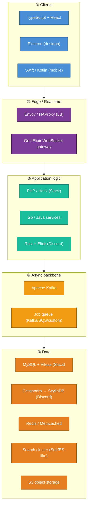
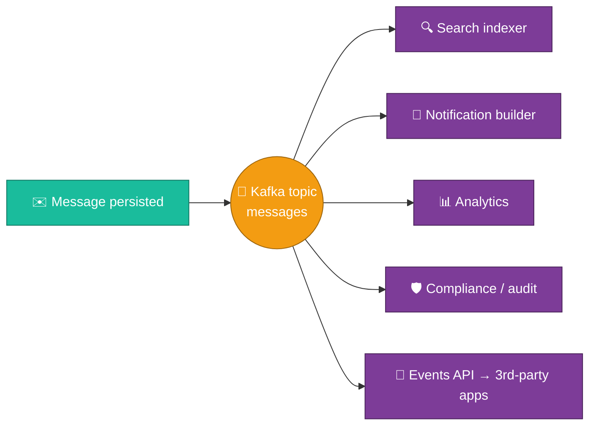
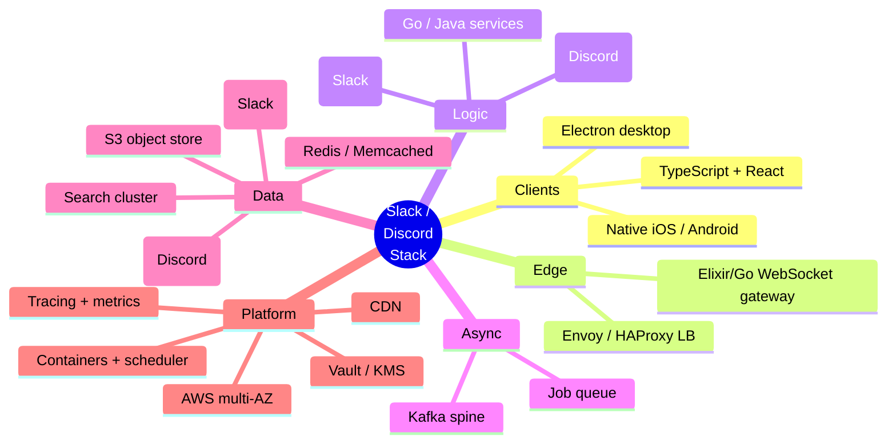

# 02 — Tech Stack (and *why* each choice)

A stack is not a shopping list. For each layer below: **what it is, why it was
chosen, what it's good at, and the trade-off you accept.** Where Slack and Discord
diverge, both are shown — they made genuinely different bets and both work.

---

## ① Client layer

| Tech | Why | Trade-off |
|------|-----|-----------|
| **TypeScript + React** (web) | Huge ecosystem, type safety on a massive codebase, component reuse across web/desktop | React's render cost on huge message lists requires heavy virtualization |
| **Electron** (desktop) | One codebase (web tech) ships to macOS/Windows/Linux | RAM-hungry (a Chromium per app) — a frequent user complaint and a real cost driver |
| **Swift / Kotlin** (mobile, native) | Battery, background limits, push integration, and smooth scrolling demand native | Two more codebases to maintain |

**Why not "just a website"?** Desktop/mobile need **background presence,
OS-level notifications, deep links, and reliable reconnection** that a browser tab
can't guarantee. Slack chose web-tech-everywhere (Electron) to limit
fragmentation; the cost is memory footprint.

:::note Discord's divergence
Discord also uses **React + Electron + React Native**, but invested heavily in
custom native modules (audio/video, the message list) because their real-time
voice path is far more latency-sensitive than text chat.
:::

---

## ② Edge / real-time tier

This tier exists **only** to hold millions of persistent connections and shuttle
frames. It is deliberately *dumb and scalable*, separate from business logic.

| Tech | Why |
|------|-----|
| **L4/L7 load balancers (Envoy/HAProxy/ELB)** | Terminate TLS, spread connections, drain hosts gracefully for deploys |
| **WebSocket gateway** — historically Slack used a Go/Java tier; **Discord famously built theirs in Elixir (BEAM)** | The BEAM VM is purpose-built for **millions of lightweight processes** (one per connection), with cheap scheduling and per-process isolation |

**Why a separate tier at all?** Two reasons:

1. **Different scaling axis.** Connections are *memory- and IO-bound*; business
   logic is *CPU-bound*. Mixing them means you over-provision one to satisfy the
   other. Splitting lets each scale independently — and **lets you minimize infra
   cost** by running the gateway on memory-optimized, cheaper-per-connection
   instances.
2. **Deploy independence.** You can ship business logic 20×/day without dropping
   12M live sockets.

:::tip Why Elixir/BEAM for connections (Discord's bet)
Each WebSocket = one BEAM process (~few KB). A single node holds *hundreds of
thousands* of them. If one connection's process crashes, only that connection
dies (supervisor restarts it) — no shared heap, no GC stall across all
connections. This is the single biggest reason Discord's gateway is in Elixir.
:::

---

## ③ Application / business-logic layer

| Tech | Used by | Why | Trade-off |
|------|---------|-----|-----------|
| **PHP → Hack (HHVM)** | **Slack** | Slack's monolith began in PHP; they migrated to **Hack** (Facebook's typed PHP on HHVM) for type safety + JIT performance without a rewrite | Niche language; smaller hiring pool |
| **Go / Java** | Slack & many | Extracted services (gateway, jobs, presence) where concurrency/perf matter | More languages = more ops surface |
| **Rust** | **Discord** | Rewrote hot, latency-sensitive paths (read states, message routing) from Go to Rust to **eliminate GC tail-latency spikes** | Steeper learning curve, slower iteration |
| **Elixir** | **Discord** | Connection + real-time fan-out (see tier ②) | — |

:::note Why Discord moved Go → Rust (publicly reported)
Discord's "Read States" service in Go suffered **periodic latency spikes every ~2
minutes** caused by Go's garbage collector scanning a large in-memory cache. They
rewrote it in **Rust**, whose ownership model means **no GC**, and the spikes
disappeared — with lower memory and CPU too. This is the canonical "GC tail
latency" war story; expect it in interviews.
:::

**Architectural shape:** start as a **modular monolith** (Slack did), extract
**services along scaling/ownership seams** (gateway, presence, search,
notifications, jobs) as they each develop independent scaling needs. Resist
premature microservices — see [11-reliability-and-cost.md](./11-reliability-and-cost.md)
for why a sprawling service mesh *raises* both cost and incident rate.

---

## ④ Async backbone

| Tech | Role | Why |
|------|------|-----|
| **Apache Kafka** | Event bus + durable log for fan-out, search indexing, analytics, audit, integrations | Ordered, partitioned, replayable, high-throughput. Slack runs Kafka at large scale as the **spine connecting services**. |
| **Job queue** (Kafka-backed / SQS / custom "Jobqueue") | Deferred work: push notifications, unfurls, webhooks, link previews, exports | Decouples slow/external work from the request path so user-facing latency stays low |

**Why Kafka and not just RPC?** Three properties you can't get from synchronous
calls:

1. **Buffering** — absorbs spikes (the Monday-morning login surge) instead of
   collapsing.
2. **Replay** — rebuild a search index or a derived store by replaying the log.
3. **Fan-out decoupling** — one producer, many independent consumers (search,
   notifications, analytics, compliance) with no coordination.

---

## ⑤ Data tier

| Tech | Role | Why this one |
|------|------|--------------|
| **MySQL + [Vitess](https://vitess.io)** | **Slack's** primary store of record (messages, channels, users) | MySQL is boringly reliable; **Vitess** adds transparent **horizontal sharding, connection pooling, and query routing** on top — Slack is one of the largest Vitess users in production |
| **Cassandra → ScyllaDB** | **Discord's** message store | Wide-column, write-optimized, linearly scalable for an append-heavy workload of trillions of rows; ScyllaDB (C++ rewrite of Cassandra) cut node count & tail latency |
| **Redis / Memcached** | Caching, presence, counters, rate limits, ephemeral state | Sub-ms reads; takes load off the DB; perfect for presence and unread counts |
| **Search cluster** (Lucene-based: Solr/Elasticsearch-style) | Full-text message search | Inverted index; the only practical way to search PB of text with permissions |
| **Object storage (S3 / equivalent)** | Files, attachments, exports, avatars | Cheap, durable (11 nines), offloads bytes from the DB; pay-per-GB |

:::tip Why relational (Slack) vs. wide-column (Discord) — the real decision
Both store messages. The split:
- **Slack** has rich relational structure (workspaces ↔ channels ↔ members ↔
  messages ↔ reactions ↔ files) and complex permission queries → **relational +
  Vitess sharding**.
- **Discord** is overwhelmingly *append message, read recent by channel* with
  enormous volume → **wide-column** (partition by channel + time bucket) wins on
  write throughput and cost.

The lesson: **pick the store from the dominant access pattern, not from
familiarity.** Detailed in [04-data-model-and-storage.md](./04-data-model-and-storage.md).
:::

---

## Infrastructure & platform

| Concern | Choice | Why |
|---------|--------|-----|
| **Cloud** | AWS (Slack is a large AWS customer) | Managed building blocks, global regions, mature networking |
| **Compute** | Mix of EC2 / containers; gateway on memory-optimized, logic on compute-optimized | **Right-size per workload to minimize spend** |
| **Orchestration** | Containers + scheduler (Kubernetes / Nomad / Bedrock-style internal) | Bin-packing, autoscaling, rolling deploys |
| **Networking** | Multi-AZ within region; CDN for static assets & file downloads | Latency + resilience |
| **CDN** | CloudFront / Cloudflare-style | Serve avatars, JS bundles, file downloads near the user; **offloads origin and cuts egress** |
| **Observability** | Metrics (Prometheus-style), distributed tracing, structured logs, centralized alerting | You cannot operate this blind — see [11](./11-reliability-and-cost.md) |
| **IaC** | Terraform-style declarative infra | Reproducible, reviewable, drift-detectable |
| **Secrets** | Vault / KMS-backed | Keys never in code (cross-reference [10](./10-security-privacy-and-compliance.md)) |

:::note Cost-minimization theme (carried throughout)
Notice the recurring move: **separate workloads so each runs on the cheapest
instance class that fits**, **push bytes to CDN/object storage**, **cache
aggressively to avoid DB calls**, and **batch async work**. Idle WebSocket
connections and message-history storage are the two biggest cost centers; the
whole design quietly optimizes both. Full treatment in
[11-reliability-and-cost.md](./11-reliability-and-cost.md).
:::

---

## One-screen summary

Next: **how messages actually flow in real time** →
[03-realtime-messaging-architecture.md](./03-realtime-messaging-architecture.md).
