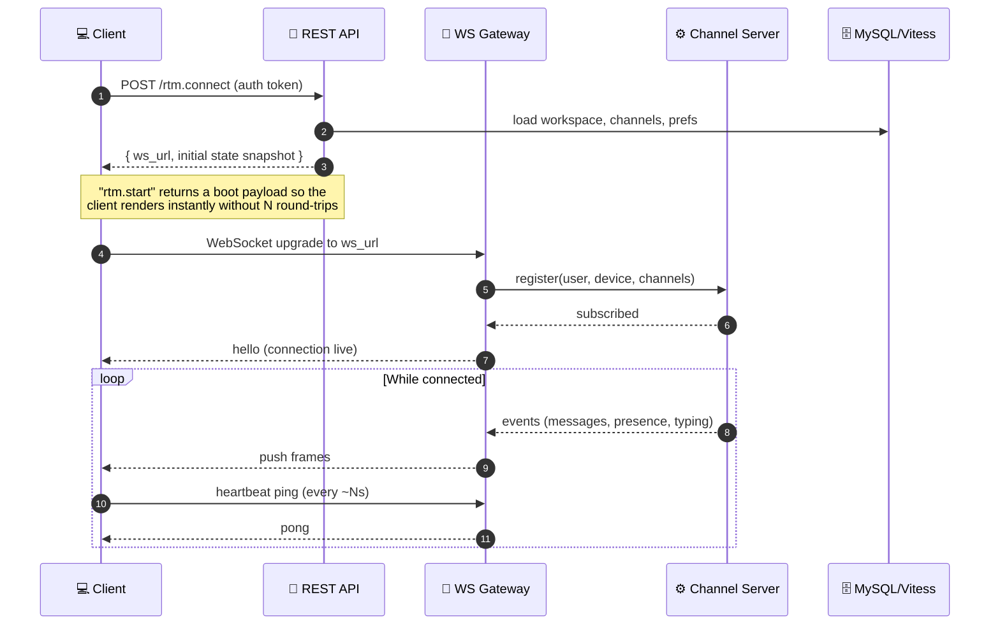
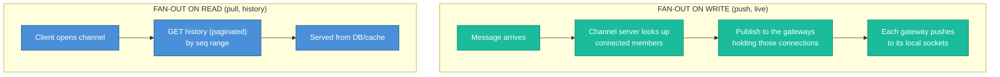
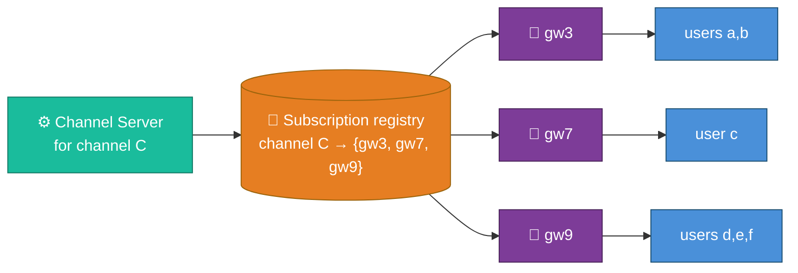
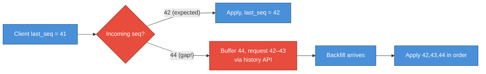
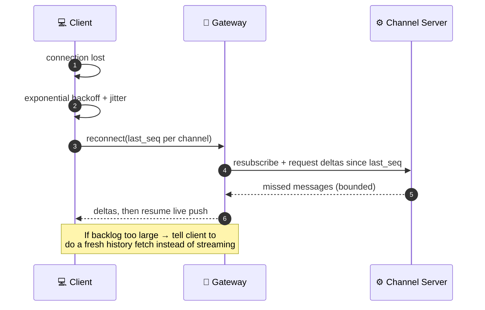
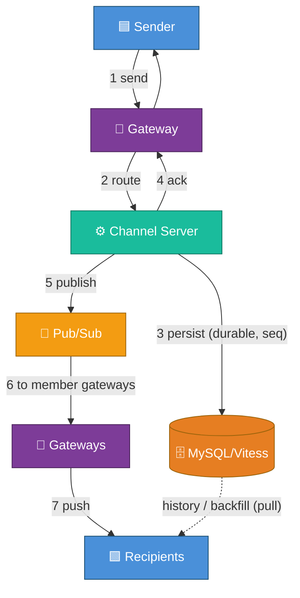

# 03 — Real-Time Messaging Architecture

This is the heart of the system. Everything else exists to support **getting a
message from one client, durably stored, and onto every other connected member's
screen in under 200 ms.**

---

## The connection lifecycle

A Slack client does **not** poll. It opens **one persistent WebSocket** and keeps
it alive. Getting that connection established is itself a designed flow.



**Why the boot snapshot (`rtm.start`/`client.boot`)?** Opening the app must feel
instant. Instead of the client making dozens of REST calls (channels, members,
unreads, prefs), the server assembles **one snapshot** of "everything you need to
render," then the WebSocket streams **deltas** from that point. This is a classic
**snapshot + delta** pattern and it's why Slack feels fast on launch.

:::caution The boot payload became a scaling problem
For huge workspaces the boot snapshot ballooned (imagine serializing 100k members
and thousands of channels). Slack re-architected toward **lazy loading** — boot
returns a *minimal* snapshot, and the rest is fetched on demand. Covered in
[08-scaling-challenges-and-solutions.md](./08-scaling-challenges-and-solutions.md).
:::

---

## The send path — what happens when you hit Enter

```mermaid
sequenceDiagram
    autonumber
    participant S as 🟦 Sender client
    participant GW as 🔌 Gateway (sender)
    participant CS as ⚙️ Channel Server
    participant DB as 🗄️ MySQL/Vitess (channel shard)
    participant PS as 📡 Pub/Sub
    participant GW2 as 🔌 Gateways (recipients)
    participant R as 🟩 Recipient clients

    S->>S: optimistic render (greyed "sending")<br/>client_msg_id = UUID
    S->>GW: send(channel, text, client_msg_id)
    GW->>CS: route to channel owner
    CS->>DB: INSERT message (assign seq #, ts)
    DB-->>CS: committed (durable)
    CS-->>GW: ack(client_msg_id → server msg_id, seq)
    GW-->>S: confirmed (✓), reconcile optimistic copy
    CS->>PS: publish(channel, message)
    PS-->>GW2: deliver to gateways holding members
    GW2-->>R: push message frame
    Note over S,R: Sender path is read-your-writes;<br/>recipients get it via fan-out (next section)
```

Five design decisions baked into this diagram:

| Decision | Why |
|----------|-----|
| **Client-generated `client_msg_id` (UUID)** | Enables **idempotent** persist (retries don't duplicate) and lets the client reconcile its optimistic copy with the server's confirmed one |
| **Optimistic UI** | The sender sees the message *immediately*; if the server later acks, swap in the real ID; if it fails, show "failed, retry" |
| **Durable write *before* fan-out** | A message you can see must be a message that survived. Never fan-out then persist — a crash would show recipients a message the store never kept |
| **Server-assigned monotonic `seq` per channel** | Gives **per-channel total order** and gap detection without a global clock |
| **Ack carries the seq** | Client can detect gaps ("I have 41 and 43, missing 42") and request a backfill |

---

## Fan-out: the central problem

One write → potentially thousands of deliveries. **How a message finds every
connected member** is *the* architecture.

There are two textbook strategies. Slack-style real-time chat uses
**fan-out-on-write to live connections** (push), backed by **fan-out-on-read** for
history.



**Why both?**

- **Push (write)** for *online* members: instant, no polling, low latency.
- **Pull (read)** for *history & offline catch-up*: you can't push 10,000 backlog
  messages on reconnect — the client requests a range. Pull also avoids storing a
  per-user copy of every message (which fan-out-on-write-to-inbox, à la Twitter,
  would require and which is far too expensive at chat volume).

### The routing question: where do connections for channel X live?

A channel's members are connected to **many different gateway nodes**. The channel
server must know *which gateways* currently hold *at least one member* of the
channel, and publish only to those.



This **subscription registry** (channel → set of gateway nodes, maintained as
clients subscribe/unsubscribe) is what lets fan-out publish to *3 nodes* instead
of *broadcasting to all gateways*. At Slack's scale this is the difference between
sane and impossible network traffic.

:::tip Slack's real building block — "Flannel" / the channel-server edge cache
Slack publicly described an edge service (historically nicknamed **Flannel**, now
evolved) that acts as a **query engine + cache co-located with the WebSocket
edge**. It caches workspace metadata (users, channels) at the edge so the client's
constant lookups ("who is @U123?", "what's in this channel?") are answered near
the connection instead of round-tripping to the core DB. This both **cuts latency
and slashes DB load** — a recurring cost lever.
:::

---

## Ordering & delivery guarantees (the subtle part)

| Guarantee | How it's achieved |
|-----------|-------------------|
| **Per-channel total order** | Monotonic `seq` assigned at persist time by the single writer for that channel's shard |
| **No global order needed** | Users only ever perceive order *within* a channel; cross-channel global order has no meaning |
| **At-least-once on the wire** | Push may retry on reconnect; the network is unreliable |
| **Effectively exactly-once for the user** | Client dedupes by `client_msg_id` / `seq`; rendering is idempotent |
| **Gap detection & repair** | Client tracks last-seen `seq`; on a gap or reconnect it requests the missing range (pull) |



This **sequence-number + gap-repair** scheme is how Slack guarantees you never
*permanently* miss a message even though the live push channel is only
at-least-once and lossy. The durable, ordered log in the DB is the source of
truth; the WebSocket is just a fast-path notifier.

---

## Reconnection (the part everyone forgets)

Connections drop constantly (laptops sleep, wifi flaps, deploys drain gateways).
The reconnect flow must be **cheap and correct**:



**Why backoff + jitter is non-negotiable:** when a gateway dies, *all* its
connections reconnect at once. Without jittered backoff they form a
**thundering herd** that knocks over the next gateway — a cascading outage. This
is exactly the class of failure behind Slack's Jan 2021 incident
([09-real-world-incidents.md](./09-real-world-incidents.md)).

---

## Putting it together



Next: **how that durable store is sharded and modeled** →
[04-data-model-and-storage.md](./04-data-model-and-storage.md).
