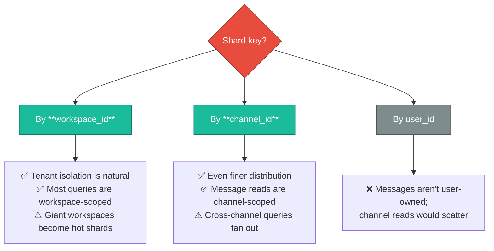
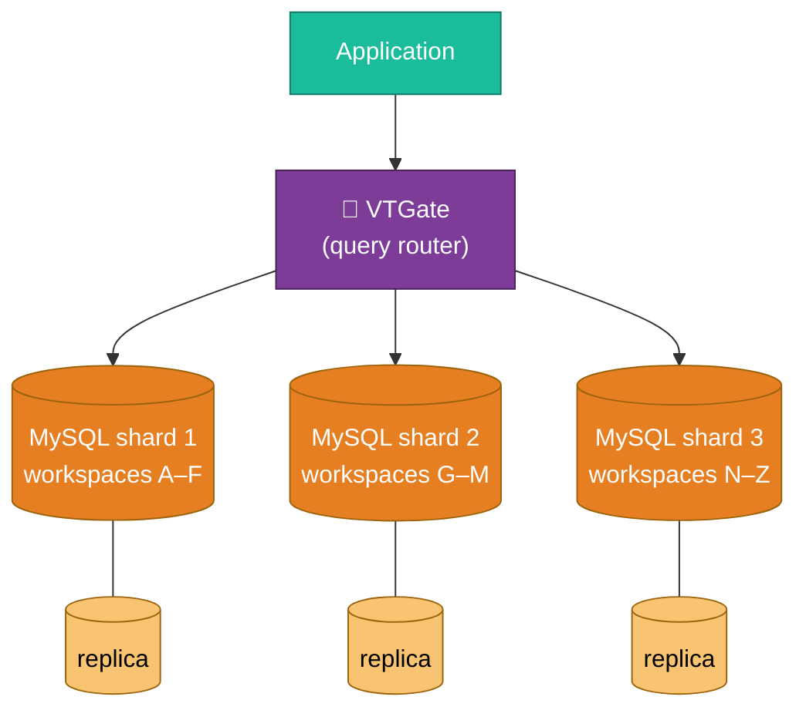
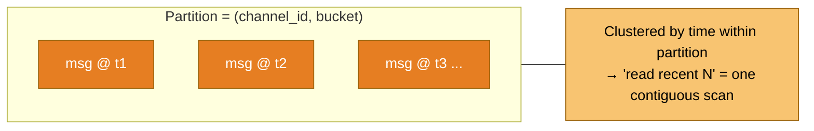
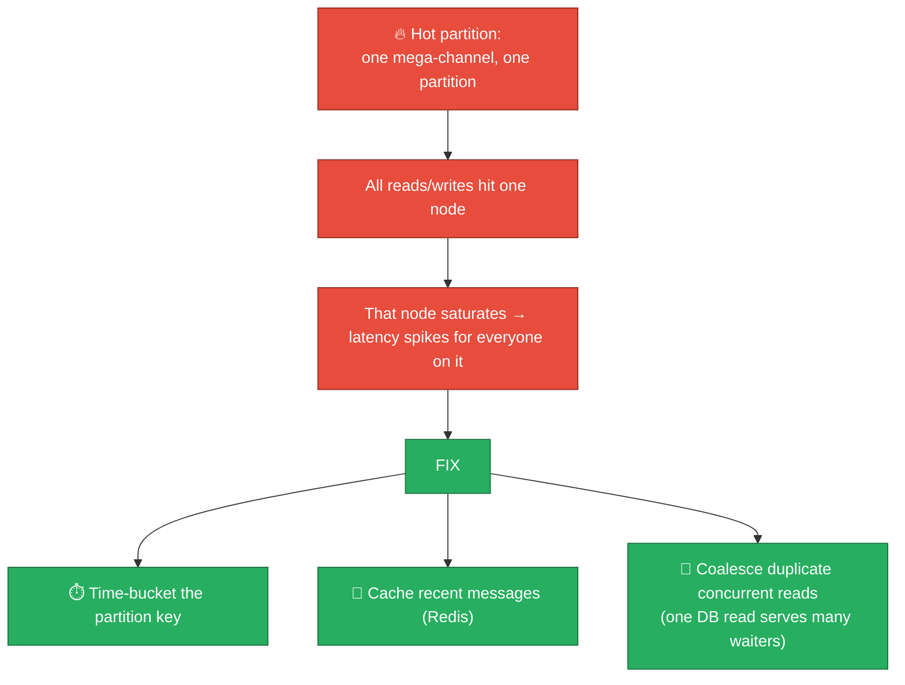
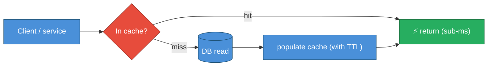

# 04 — Data Model & Storage

The store of record is where durability, ordering, and tenant isolation are won or
lost. This file covers **the schema, the sharding strategy, and the two genuinely
different bets** Slack (MySQL + Vitess) and Discord (Cassandra → ScyllaDB) made.

---

## Core entities

```mermaid
erDiagram
    WORKSPACE ||--o{ CHANNEL : contains
    WORKSPACE ||--o{ USER : has_member
    CHANNEL ||--o{ MEMBERSHIP : has
    USER ||--o{ MEMBERSHIP : in
    CHANNEL ||--o{ MESSAGE : holds
    USER ||--o{ MESSAGE : authors
    MESSAGE ||--o{ REACTION : has
    MESSAGE ||--o{ MESSAGE : threads
    MESSAGE ||--o{ FILE : attaches

    WORKSPACE {
        id pk
        name
        plan
        retention_policy
        region
    }
    CHANNEL {
        id pk
        workspace_id fk
        type "public|private|dm|shared"
        name
    }
    MESSAGE {
        id pk
        channel_id fk
        seq "per-channel monotonic"
        author_id fk
        ts
        client_msg_id "idempotency"
        body
        thread_root_id
        edited_ts
        deleted_ts
    }
    MEMBERSHIP {
        user_id fk
        channel_id fk
        last_read_seq
        notif_pref
    }
```

A few schema decisions that matter at scale:

| Field/choice | Why |
|--------------|-----|
| `seq` per channel | Ordering + gap detection without a global clock (see [03](./03-realtime-messaging-architecture.md)) |
| `client_msg_id` UNIQUE per channel | Idempotent inserts — a retried send can't duplicate |
| `deleted_ts` (soft delete) | Compliance/eDiscovery & audit need the tombstone, not a hard delete |
| `last_read_seq` on membership | Unread counts are computed from `(max seq) − last_read_seq` — cheap (see [05](./05-presence-typing-and-unreads.md)) |
| `workspace_id` on everything | The **shard key candidate** and the **authz boundary** |

---

## Sharding: the central scaling decision

You cannot fit billions of messages and millions of tenants on one MySQL box. The
question is **what to shard on.**



**Slack's practical answer: shard primarily by workspace, with Vitess managing the
physical placement and resharding.** Workspace-sharding gives clean tenant
isolation (a query for one workspace touches one shard) and matches the dominant
access pattern. The escape hatch for giant workspaces is covered below and in
[08](./08-scaling-challenges-and-solutions.md).

### What Vitess buys you

[Vitess](https://vitess.io) sits in front of many MySQL shards and makes them look
like one logical database.



| Vitess capability | Why it matters |
|-------------------|----------------|
| **Transparent sharding** | App issues normal SQL; VTGate routes to the right shard by shard key |
| **Online resharding** | Split a hot shard *without downtime* — critical when a workspace blows up |
| **Connection pooling** | MySQL handles few connections poorly; Vitess multiplexes thousands of app connections onto few DB connections (huge cost & stability win) |
| **Query guardrails** | Blocks unbounded/cross-shard scatter queries that would melt the DB |
| **Replica routing** | Reads → replicas, writes → primary, automatically |

:::tip Why "boring" MySQL + Vitess beats a trendy NewSQL
Slack bet on **operational maturity**: MySQL's failure modes, backup/restore, and
replication are deeply understood, and Vitess adds scale *without* abandoning that
knowledge. The lesson for interviews: **scaling a well-understood system usually
beats adopting a less-understood "scalable" one.** You're choosing your 3 a.m.
debugging surface.
:::

---

## The Discord bet: wide-column (Cassandra → ScyllaDB)

Discord's workload is *different*: overwhelmingly **append a message; read the most
recent N messages of a channel.** That's a near-perfect fit for a wide-column
store partitioned by `(channel_id, time_bucket)`.



**Why bucket by time?** A wildly popular channel could otherwise grow one
partition unbounded (a **hot/large partition** — Cassandra's classic failure). By
bucketing (e.g., per ~10-day window), each partition stays bounded and reads of
"recent messages" hit one or two buckets.

:::note Discord's publicly reported numbers
Discord migrated their message store from **Cassandra to ScyllaDB** (a C++
reimplementation of Cassandra) and reported going from a large, latency-spiky
Cassandra cluster to **far fewer ScyllaDB nodes** handling **trillions of
messages**, with dramatically lower and more predictable tail latency. ScyllaDB's
shard-per-core architecture and lack of JVM GC were the wins. They also wrote
data-services in **Rust** in front of it to coalesce concurrent identical reads.
:::

### The "hot partition" problem (and the fix)



That **read-coalescing** trick (Discord's "request coalescing" in their Rust data
service) is elegant: if 10,000 users open the same channel at the same instant,
you issue **one** database read and fan the result out to all 10,000 waiters
instead of hammering the DB 10,000 times. It's a cost lever *and* a stability lever.

---

## Caching strategy



| Cached thing | Store | Invalidation |
|--------------|-------|--------------|
| Recent messages per channel | Redis | TTL + write-through on new message |
| Workspace/channel/user metadata | Edge cache (Flannel-style) + Redis | Event-driven on change |
| Unread counts / read state | Redis | Updated on read marker move |
| Permission checks | Short-TTL cache | TTL (security-sensitive — keep short) |

**Caching is the #1 lever for both latency and cost** — every cache hit is a DB
read you didn't pay for. But cache the *right* things: permission caches must have
short TTLs (a removed member must lose access fast — see
[10](./10-security-privacy-and-compliance.md)).

---

## Storage cost minimization

| Technique | Effect |
|-----------|--------|
| **Tiered storage** — hot recent messages on fast disk, old messages on cheaper tier/compressed | Most reads are recent; old data rarely touched |
| **Files in object storage (S3), not the DB** | DB stays small & fast; S3 is far cheaper per GB |
| **Compression** of message bodies & search segments | Text compresses well (often 3–5×) |
| **Retention enforcement** | Plans with limited history (e.g., free tier) let you *delete* old data — both a product and a cost decision |
| **Replica count tuned per data class** | Messages need strong replication; ephemeral presence does not |

Next: **the three deceptively hard "small" features** →
[05-presence-typing-and-unreads.md](./05-presence-typing-and-unreads.md).
