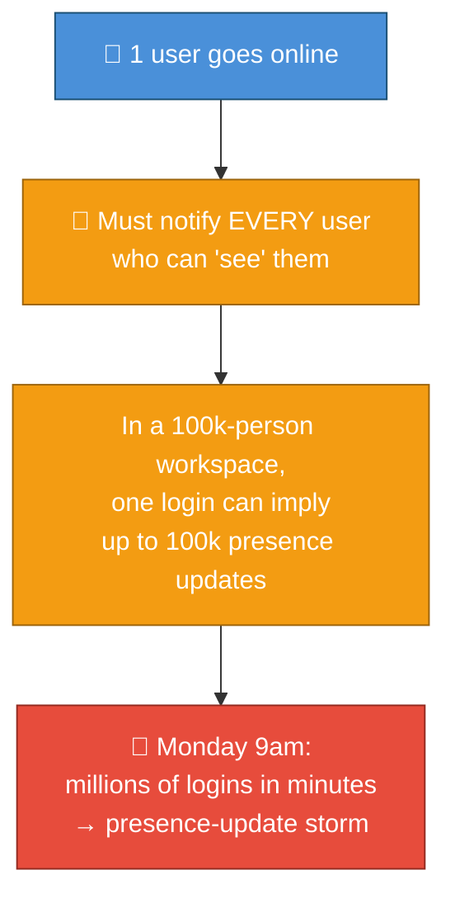
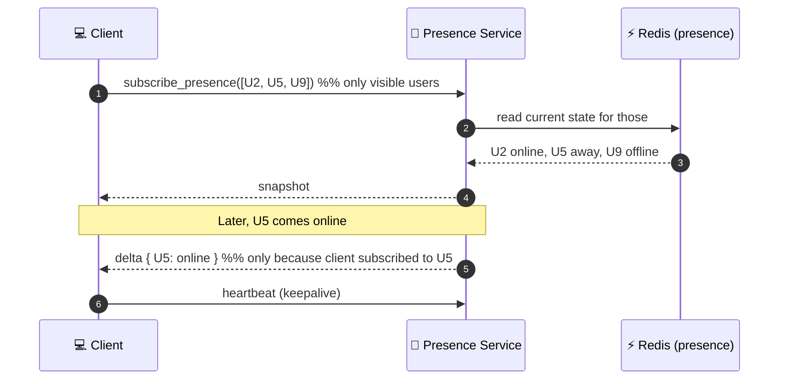
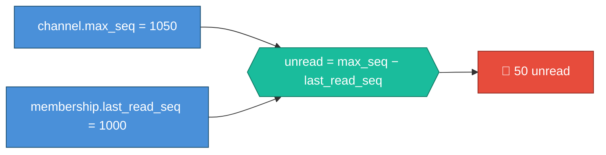
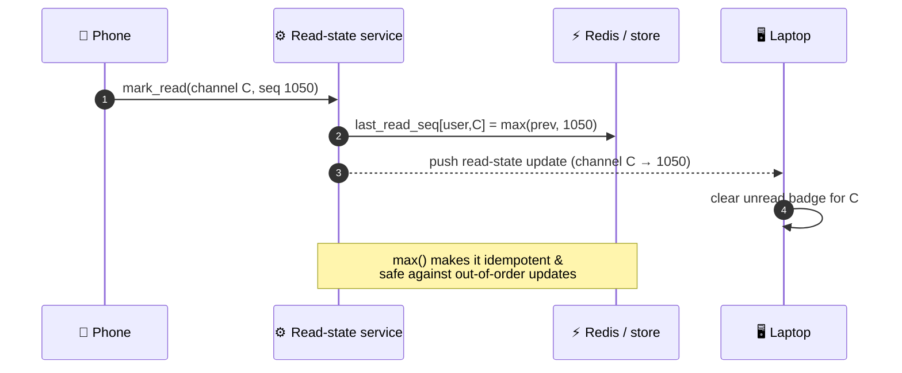

# 05 — Presence, Typing & Unread Counts

These look trivial ("just a green dot") and are, in practice, **some of the
highest-volume, hardest-to-scale features** in the entire product. They generate
*more events than messages do*, carry *low value per event*, and yet users notice
instantly when they're wrong.

---

## Why presence is hard

Presence = "is this user online, away, or offline, right now?" The difficulty:



Naively, presence is **O(users × watchers)** broadcast — catastrophic.

### Production techniques to tame presence

| Technique | What it does | Why it works |
|-----------|--------------|--------------|
| **Subscribe only to *visible* users** | Client tells server "I'm looking at these 30 people" (sidebar, open channel) — server only pushes presence for *those* | You don't care about presence of 99,970 people you can't see right now |
| **Pull on demand, not push-all** | Presence for a member list is *fetched* when you open it, then incrementally updated | Converts a broadcast storm into bounded, lazy queries |
| **Coalesce & debounce** | Batch presence changes over a short window; send one update, not ten | Flapping connections don't generate flapping events |
| **Store in memory/Redis, not the DB** | Presence is ephemeral; losing it on restart is fine | No durability cost; sub-ms reads/writes |
| **Heartbeat-based expiry** | A connection's presence has a TTL refreshed by heartbeat; miss heartbeats → auto-offline | Self-healing; no explicit "logout" needed |

:::tip Slack's actual move (publicly reported)
Slack rebuilt presence so the client **subscribes to presence only for users it
currently displays**, and the server pushes changes for just that set. This turned
an unbounded broadcast into a bounded, per-client subscription — the single most
important presence optimization, and a direct **infra-cost reducer** (it
eliminated the bulk of presence traffic).
:::



---

## Typing indicators

"Alice is typing…" is even higher-frequency than presence but **needs zero
durability** — it's the most ephemeral data in the system.

| Property | Choice | Why |
|----------|--------|-----|
| Storage | **None** (transient pub/sub only) | Nobody cares about "was typing 5s ago" |
| Scope | Only to **currently-open** channel members | A typing event for a channel nobody's viewing is wasted |
| Rate | **Throttled** client-side (send "typing" at most every few seconds) | A keystroke-per-event would be absurd traffic |
| Expiry | Auto-clear after a few seconds of no update | Self-cleaning |


The lesson: **match durability and delivery cost to the value of the data.**
Spending message-grade infrastructure on typing indicators is a classic
over-engineering mistake.

---

## Unread counts & read state

This is where correctness matters most — users *trust* the unread badge. The
elegant trick: **don't count, subtract.**



Because every message has a per-channel `seq` (from [03](./03-realtime-messaging-architecture.md)),
the unread count is just **arithmetic on two integers** — no scanning of unread
messages, no per-message read flags. When the user reads a channel, you advance
`last_read_seq`. That's it.

### Cross-device read sync

The hard part is **N devices, one truth**: read on your phone, the badge must
clear on your laptop.



| Decision | Why |
|----------|-----|
| Read state keyed by **(user, channel)**, not device | One truth per user; devices converge to it |
| Always `max(existing, incoming)` | Idempotent; tolerates retries & out-of-order delivery — read markers only move forward |
| Pushed to all the user's devices | Cross-device consistency, the whole point |
| Cached in Redis | Read/written constantly; DB-only would be too slow |

:::caution Discord's read-state war story
Discord's **Read States** service (tracking last-read per user per channel —
exactly this) was the service whose **Go garbage collector caused latency spikes
every ~2 minutes**, prompting the famous **rewrite to Rust**. It's a perfect
example of how a "simple counter" service becomes a tail-latency battleground at
scale. (See [02](./02-tech-stack.md) and [09](./09-real-world-incidents.md).)
:::

---

## The unifying principle

```mermaid
mindmap
  root(("Match cost<br/>to value"))
    Messages
      Durable
      Ordered
      Exactly-once feel
      Expensive infra justified
    Unreads
      Derived (seq math)
      Cheap, cached
      Idempotent max()
    Presence
      Ephemeral (Redis)
      Subscribe to visible only
      Coalesced
    Typing
      No storage
      Throttled
      Auto-expire
```

The senior insight running through this file: **not all real-time data deserves
the same guarantees.** Spend durability and consistency where users would notice
loss (messages, read state); spend nothing on what's worthless a second later
(typing). Getting this gradient right is what keeps the infra bill — and the
operational risk — sane.

Next: **search across petabytes, with permissions** →
[06-search-and-indexing.md](./06-search-and-indexing.md).
