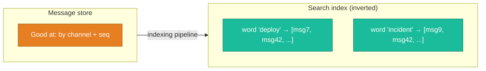
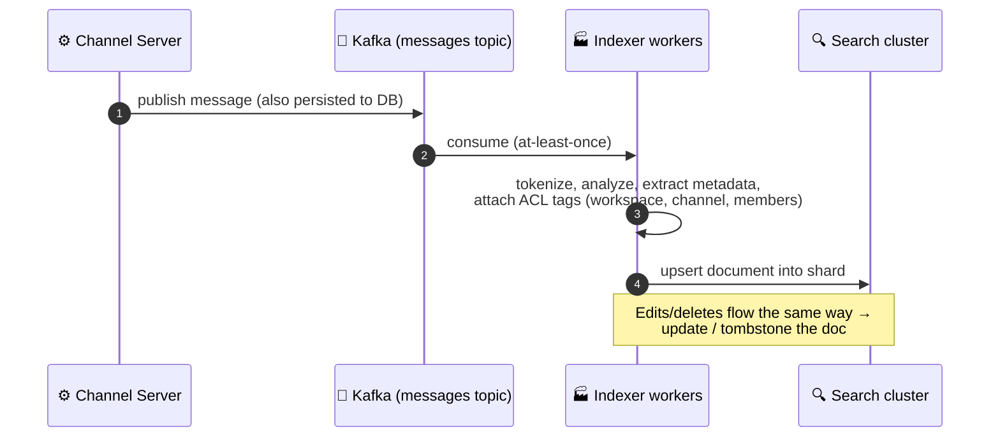
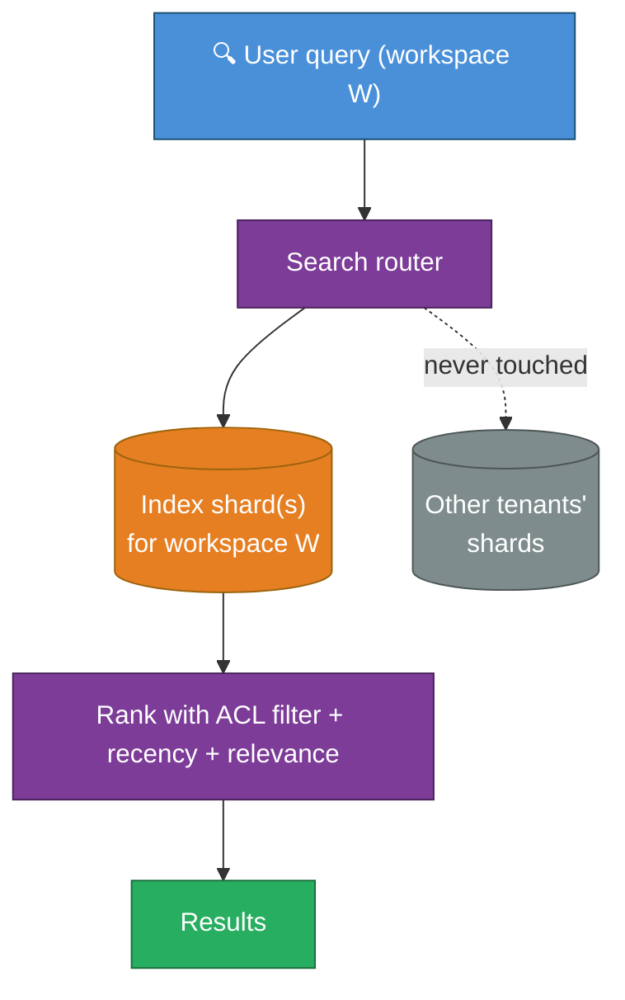
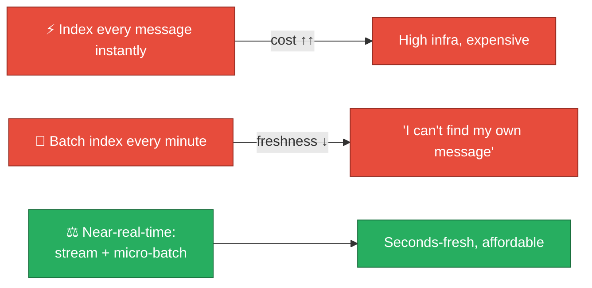

# 06 — Search & Indexing

Search is a separate system from messaging with its own scaling story. The
constraints: **petabytes of text, strict per-user permissions, multi-tenant
isolation, and near-real-time freshness** ("I just sent it — I expect to find
it").

---

## Why search can't reuse the message DB

The message store (MySQL/Vitess or ScyllaDB) is optimized for **"give me messages
in channel C by seq range."** It is *terrible* at **"find every message
containing the word 'deploy' that this user is allowed to see."** The latter needs
an **inverted index** (word → list of message IDs), which is what a Lucene-based
engine (Solr / Elasticsearch-style) provides.

---

## The indexing pipeline

Search freshness comes from an **asynchronous pipeline fed by the same Kafka
message stream** that drives everything else (from [02](./02-tech-stack.md)).

| Stage | Detail | Why |
|-------|--------|-----|
| **Source = Kafka** | Index off the durable event log, not a synchronous call | Decouples search from the send path; replayable to rebuild the index |
| **At-least-once + idempotent upsert** | Re-indexing the same message is harmless (keyed by message ID) | Survives consumer retries |
| **ACL tags baked into the document** | Each doc carries who-can-see-it metadata | Permission filtering happens *in the query*, not after |
| **Edits/deletes propagate** | Edited body re-indexed; deleted → tombstone | Search must not surface deleted content |

:::caution The permission trap (a real correctness bug class)
The dangerous mistake: search first, filter permissions after. If you return the
top 50 matches *then* drop the ones the user can't see, you might show **0
results** when 49 of the top 50 were in private channels — or worse, leak that a
message *exists*. **Permissions must be a filter inside the query**, so the engine
only ever scores documents the user can see. This is both a correctness and a
**privacy/compliance** requirement (see [10](./10-security-privacy-and-compliance.md)).
:::

---

## Sharding the search index

Search is sharded along the **same tenancy boundary** as the data — by workspace
— so a query touches only that tenant's index and never crosses tenant lines.

- **Large tenants** get **multiple index shards** (split by channel/time); **small
  tenants** are packed many-to-a-shard for **cost efficiency** (don't dedicate a
  whole node to a 5-person workspace).
- This **tenant-packing** is a major infra-cost lever: search clusters are
  expensive, and bin-packing small tenants keeps utilization high.

---

## Relevance & ranking

A useful chat search blends multiple signals:

| Signal | Why it matters in chat |
|--------|------------------------|
| **Text match (BM25-style)** | Baseline relevance |
| **Recency** | In chat, newer is usually more relevant than older |
| **Channel/author affinity** | Messages from channels/people you interact with rank higher |
| **Message vs. file vs. thread** | Different result types, ranked & grouped |

Modern systems increasingly add **semantic / vector search** (embeddings) for
"find messages *about* X even if they don't contain the exact word." That's an
additional index (an ANN vector store) fed by the same pipeline — a natural
extension point, and where AI features (summarize a channel, semantic recall) plug
in.

---

## Freshness vs. cost trade-off

The sweet spot: **stream from Kafka with small micro-batches**, giving
seconds-level freshness without paying for per-message synchronous indexing. Users
perceive "instant," the cluster isn't overwhelmed, and the batch amortizes index
write overhead.

Next: **the client and mobile story — sync, offline, reconnection storms, push** →
[07-client-and-mobile.md](./07-client-and-mobile.md).
