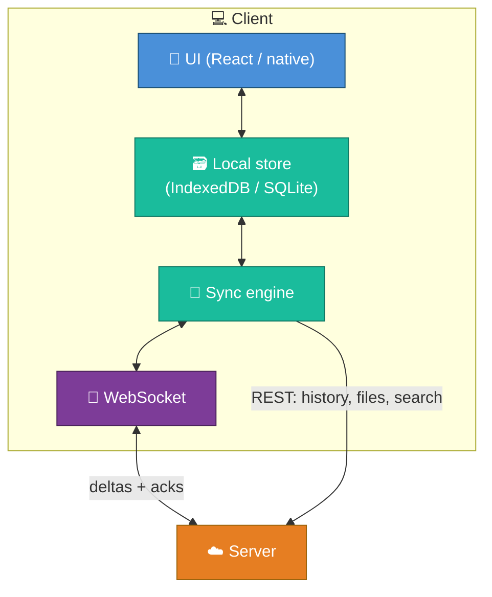
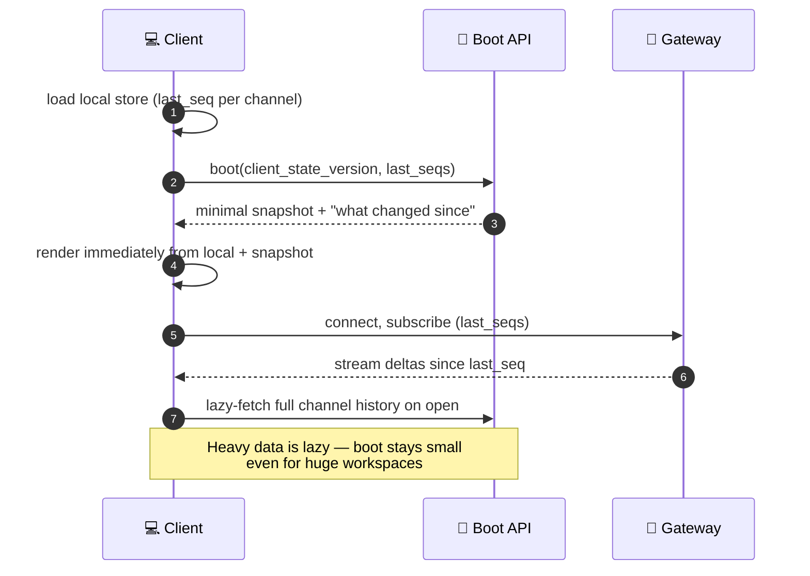
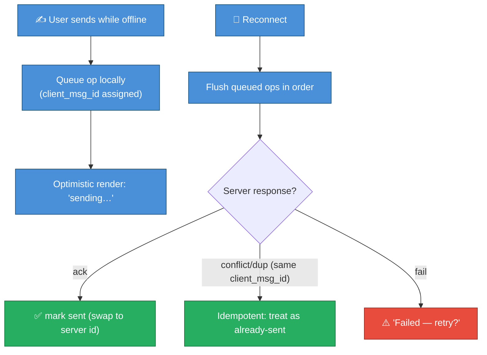
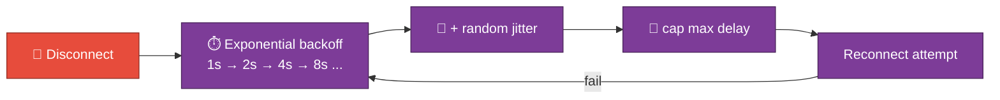
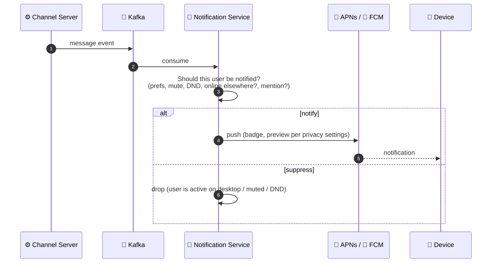

# 07 — Client & Mobile Architecture

The server is only half the system. A chat client is a **distributed system in its
own right**: it holds local state, must survive going offline, reconcile on
reconnect, sync across devices, and respect mobile's brutal battery/data/background
constraints. This is the full-stack half of the case study.

---

## Client as a local cache + sync engine

A modern Slack client is **not** a thin view over the server. It maintains a
**local store** (channels, recent messages, unreads, members) and treats the
network as a sync channel.

**Why local-first?** Instant UI (render from local store, no spinner), offline
read access, and **far fewer server round-trips** (a cost win). The cost is
*complexity*: now you have a cache-coherence problem between client and server.

---

## Cold start: snapshot + delta

When the app opens, it must reconcile its (possibly stale) local store with the
server.

This is the **lazy-loading boot** Slack moved to after the "fat boot payload"
problem (see [08](./08-scaling-challenges-and-solutions.md)). The principle:
**render from what you have, fetch the rest on demand, stream the live tail.**

---

## Offline & optimistic operations

The `client_msg_id` (from [03](./03-realtime-messaging-architecture.md)) is what
makes offline send safe: if the client isn't sure whether a queued message reached
the server, it **retries with the same ID**, and the server's idempotent insert
guarantees no duplicate. **Offline correctness is bought entirely by
client-generated idempotency keys.**

---

## The reconnection storm (client's role)

When a gateway dies, thousands of clients reconnect at once. The client is the
*first line of defense* against turning that into a cascading outage.

| Client tactic | Prevents |
|---------------|----------|
| **Exponential backoff** | Hammering a recovering server |
| **Jitter** (randomize the delay) | All clients reconnecting in lockstep (synchronized herd) |
| **Resume with `last_seq`** | Re-downloading everything; server sends only deltas |
| **Server-driven backpressure** | Server can tell clients "reconnect to URL X" / "wait N seconds" to spread load |

This client-side discipline plus server-side admission control is the joint
defense behind avoiding the [Jan 2021-class outage](./09-real-world-incidents.md).

---

## Push notifications (when the socket is gone)

On mobile, the OS kills your socket in the background. Delivery then goes through
**APNs (Apple) / FCM (Google)** via a dedicated notification service.

| Decision | Why |
|----------|-----|
| **Async via Kafka, off the send path** | Push is slow & external; never block message delivery on it |
| **Server-side notification *decision*** | Don't notify if the user is active on another device, channel is muted, or DND is on — respects attention & cuts push volume (cost) |
| **Privacy-aware previews** | Honor "hide message preview" settings; don't leak content to the lock screen |
| **Coalescing** | Batch "5 new messages" instead of 5 buzzes |

:::tip Notification decisions are a cost *and* trust lever
Every suppressed-but-correct push saves money (APNs/FCM volume, server work) and
*saves the user's attention*. Getting "don't notify me on my phone when I'm
clearly active on my laptop" right is a surprisingly deep cross-device-state
problem — it needs the same presence/read-state truth from [05](./05-presence-typing-and-unreads.md).
:::

---

## Mobile-specific constraints

| Constraint | Design response |
|------------|-----------------|
| **Battery** | Minimize wakeups; rely on push for background, not a kept-alive socket; batch network |
| **Data caps / metered networks** | Deltas not full syncs; compress; lazy-load images/files |
| **Background execution limits** | OS suspends the app → use push to wake, then sync the tail on foreground |
| **Flaky networks (mobile/transit)** | Aggressive local caching + the offline queue above; assume the network is *usually* bad |
| **Smaller memory** | Don't hold all history in RAM; window the message list, evict old |
| **Native rendering** | Long message lists need native virtualization for smooth scroll |

---

## Desktop (Electron) trade-offs

| Pro | Con |
|-----|-----|
| One web codebase → mac/win/linux | Each app bundles Chromium → high RAM (a real, publicized user complaint) |
| Fast feature parity with web | Memory pressure with many workspaces open |
| Native OS hooks (notifications, tray, deep links) | Mitigations needed: shared process model, lazy workspace loading, tab suspension |

The recurring full-stack theme: **the client absorbs complexity (local store,
idempotency, backoff, sync) so the system stays correct and cheap.** A "dumb"
client would push that cost back onto the server — more round-trips, more load,
worse offline behavior.

Next: **the headline scaling challenges and their solutions** →
[08-scaling-challenges-and-solutions.md](./08-scaling-challenges-and-solutions.md).
