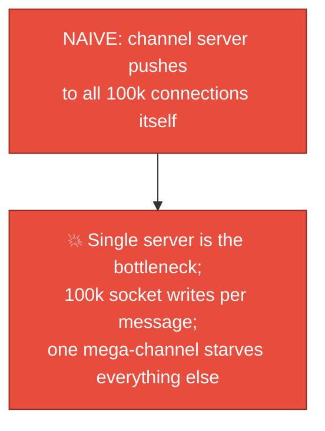
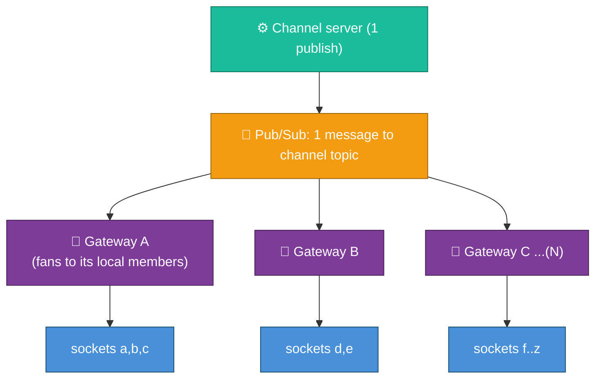
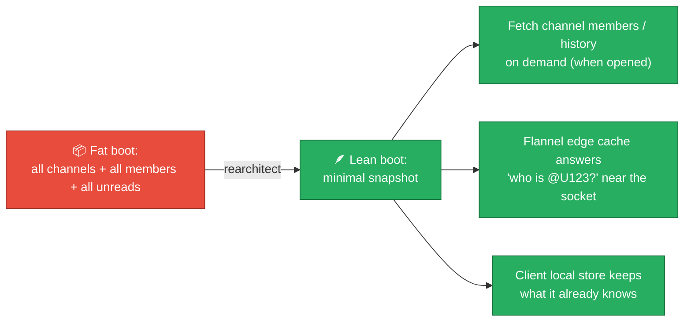
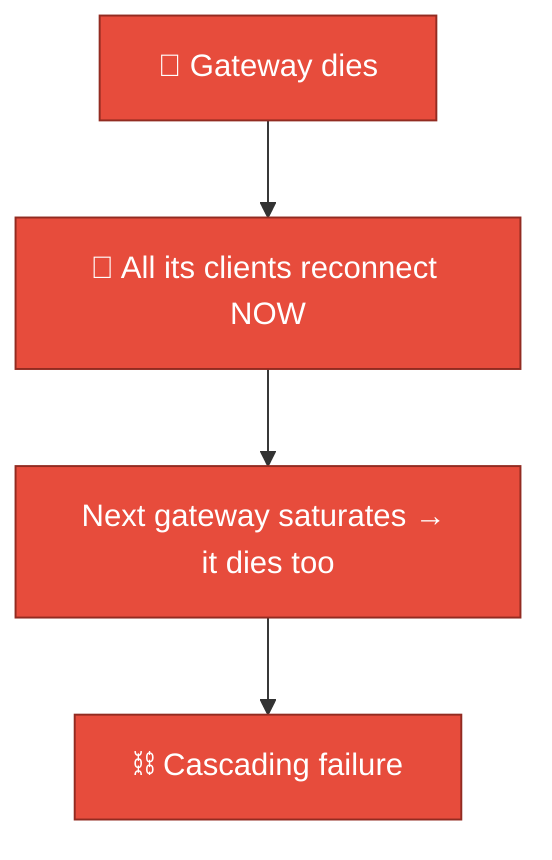
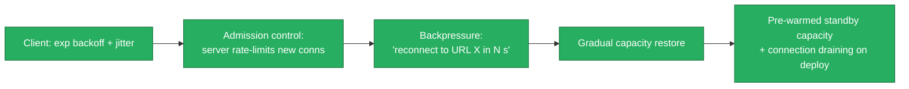
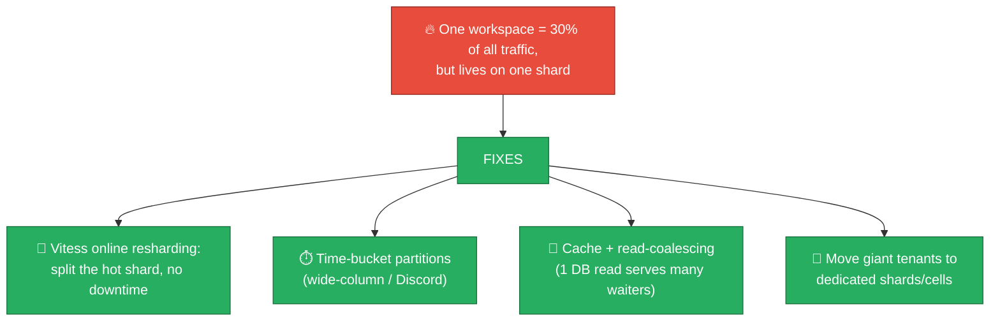
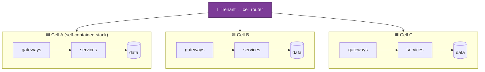
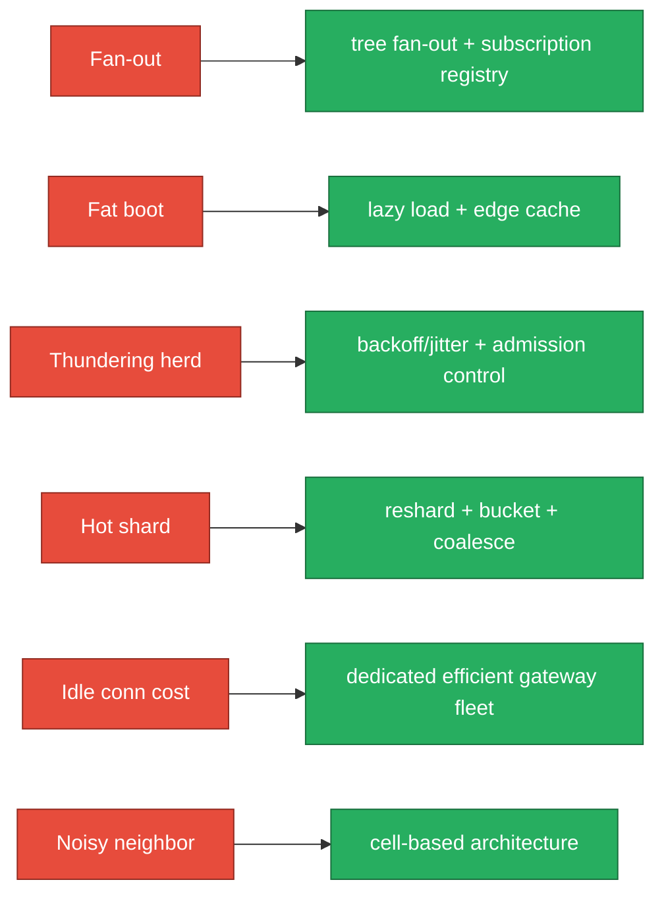

# 08 — Scaling Challenges & Solutions

Each challenge below is framed the way a real design review (or interview) runs it:
**Problem → Naive solution → Why it breaks → Production solution → Trade-off.**
These are the problems that actually keep this kind of system's engineers up at
night.

---

## Challenge 1 — Fan-out to huge channels

**Problem.** A message to `#general` in a 100,000-person workspace must reach every
connected member. One write, up to 100k deliveries.

**Production solution: hierarchical / tree fan-out across the gateway fleet.**

The channel server publishes **once**; the pub/sub layer delivers to the **set of
gateways that hold members** (the subscription registry from
[03](./03-realtime-messaging-architecture.md)); each gateway does its **local**
fan-out in parallel. Work is spread across the whole fleet, not one node.

| Trade-off | Note |
|-----------|------|
| More moving parts (registry, pub/sub) | Worth it; the alternative doesn't scale at all |
| Registry must stay accurate | Stale entries waste a push; missing entries drop delivery → backed up by pull/backfill |

---

## Challenge 2 — The fat boot payload

**Problem.** `rtm.start` returned *everything* about a workspace on connect. For a
huge workspace that payload became enormous and slow — every reconnect re-sent
megabytes.

**Naive fix:** paginate the payload. Helps a little; still front-loads too much.

**Production solution (Slack's actual evolution): lazy loading + flannel edge
cache + client-side store.**

| Trade-off | Note |
|-----------|------|
| More on-demand requests | But each is tiny & cacheable; total bytes & latency drop massively |
| Client complexity ↑ | Needs the local store + sync engine (see [07](./07-client-and-mobile.md)) |

---

## Challenge 3 — The thundering herd / reconnection storm

**Problem.** A gateway (or whole AZ) drops. All its connections reconnect *at the
same instant*, overwhelming the survivors → cascade.

**Production solution: layered defense.**

| Layer | Role |
|-------|------|
| Client backoff + jitter | Spreads the herd over time (see [07](./07-client-and-mobile.md)) |
| Admission control | Server caps accept-rate so it never tips over |
| Backpressure / redirect | Actively steer clients to spare capacity |
| Connection draining | Deploys don't drop all sockets at once |

This exact failure mode is what bit Slack on **Jan 4, 2021** — detailed in
[09-real-world-incidents.md](./09-real-world-incidents.md).

---

## Challenge 4 — Hot shards / hot partitions

**Problem.** One enormous workspace (or one viral channel) concentrates load on a
single shard/partition.

The combination of **online resharding** (Vitess), **time-bucketing** (wide-column),
and **read-coalescing** (Discord's Rust services) is the standard toolkit. See
[04](./04-data-model-and-storage.md).

---

## Challenge 5 — Cost of millions of idle connections

**Problem.** 12M mostly-idle WebSocket connections still consume RAM, file
descriptors, and keepalive traffic — pure cost for zero activity.

**Production solution:**

| Lever | Effect |
|-------|--------|
| **Dedicated, memory-optimized gateway fleet** | Cheapest \$/connection; don't run logic CPUs idle just to hold sockets |
| **Efficient connection runtime (Elixir/BEAM, epoll-based)** | Hundreds of thousands of conns per node |
| **Tune heartbeat interval** | Less frequent keepalive = less traffic, but slower dead-conn detection — a real trade-off |
| **Presence subscription pruning** | Idle connections generate almost no event traffic (from [05](./05-presence-typing-and-unreads.md)) |

This is the clearest example of the **"minimize infra usage"** theme: the dominant
cost is *holding connections*, so the architecture is shaped to make idle
connections nearly free.

---

## Challenge 6 — Multi-tenant noisy neighbors → cell-based architecture

**Problem.** All tenants on shared infra means one tenant's incident (or one bad
deploy) can take down *everyone*. A single global failure domain is unacceptable
at this scale.

**Production solution: cells (a.k.a. shards/pods of the whole stack).**

| Benefit | Detail |
|---------|--------|
| **Blast-radius containment** | A failing cell affects only its tenants, not the whole platform |
| **Independent deploys/canaries** | Roll out to one cell first; bad change ≠ global outage |
| **Capacity & data-residency mapping** | Place a cell in the EU for EU-resident tenants (see [10](./10-security-privacy-and-compliance.md)) |
| **Horizontal growth** | Add capacity by adding cells, not by scaling one giant system |

Cell-based architecture is the **macro-scaling answer**: you stop scaling "the
system" and start scaling "the number of independent systems." It also directly
serves reliability and compliance ([10](./10-security-privacy-and-compliance.md),
[11](./11-reliability-and-cost.md)).

---

## Summary map

Next: **real, publicly reported incidents and what they taught the industry** →
[09-real-world-incidents.md](./09-real-world-incidents.md).
