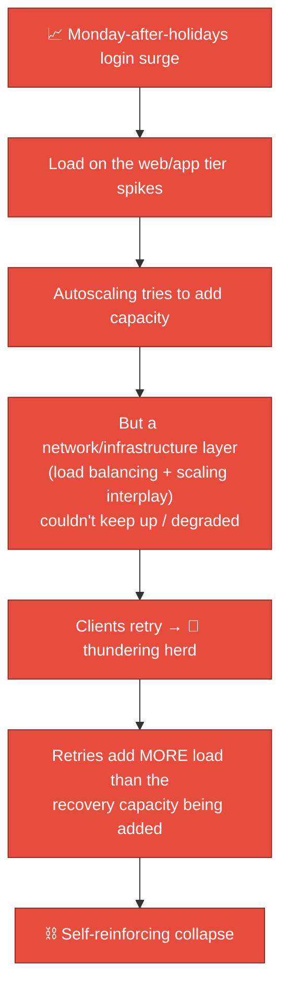
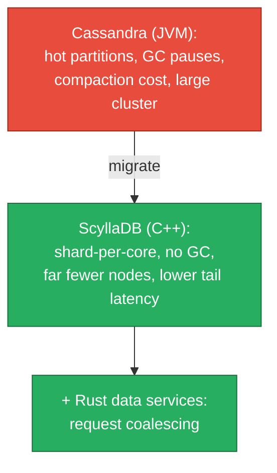
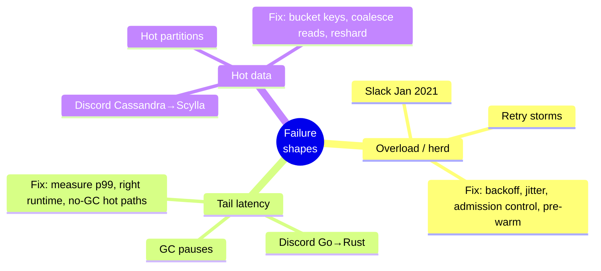

# 09 — Real-World Incidents & War Stories

These are **publicly reported** incidents and engineering migrations from Slack and
Discord. Each is presented as: what happened, the root cause, the fix, and the
**transferable lesson**. Numbers are as publicly described; treat them as
"as-reported," not internal ground truth.

---

## Incident 1 — Slack's January 4, 2021 outage

**The day everyone came back from holidays.**

### What happened
On the first Monday of 2021, as a huge wave of users logged in simultaneously after
the break, Slack suffered a widespread outage. The system entered a state where it
**could not recover under its own load** for a period — a textbook cascading
failure driven by a demand spike.

### Root cause (as publicly described by Slack Engineering)
A combination played out roughly like this:

The core dynamic: **a demand surge + retry storm outpaced the system's ability to
scale up, and the retries themselves became the load that prevented recovery.**

### The fixes / lessons
| Lesson | Why it generalizes |
|--------|--------------------|
| **Retries need backoff + jitter + caps** | Naive retries turn a blip into an outage (see [07](./07-client-and-mobile.md), [08](./08-scaling-challenges-and-solutions.md)) |
| **Provision/pre-warm for known surges** | Predictable spikes (Monday 9am, post-holiday) shouldn't be a surprise — autoscaling is too slow to catch a vertical spike |
| **Admission control / load shedding** | Better to serve *some* users well than fail *all* under overload |
| **Test the recovery path, not just steady state** | Many systems can run at scale but can't *recover* from zero under full demand |

:::tip The transferable insight
**The hardest load to handle is not peak steady-state — it's the recovery from
zero under full demand.** A system that scales fine day-to-day can still be unable
to "cold start" back to health if retries arrive faster than capacity. Design for
the recovery path explicitly.
:::

---

## Incident/Migration 2 — Discord: Go → Rust (the GC tail-latency story)

### What happened
Discord's **"Read States"** service (tracks which messages each user has read —
the exact feature in [05](./05-presence-typing-and-unreads.md)) was written in Go.
They observed **latency spikes roughly every 2 minutes**, even though the code
hadn't changed and traffic was steady.

### Root cause
Go's **garbage collector** periodically scanned a **large in-memory cache** (the
read states). Each scan caused a CPU/latency spike — and because the cache was big,
the spikes were significant and regular.

### The fix
Rewrite the service in **Rust**, which has **no garbage collector** (memory is
managed via ownership at compile time). Results, as publicly reported: the periodic
spikes vanished, and the Rust version used **less CPU and memory** while handling
the same load.

| Lesson | Why it generalizes |
|--------|--------------------|
| **GC tail latency is real** at scale with large heaps | Managed languages trade predictable latency for productivity |
| **Match language to latency profile** | Hot, latency-critical, large-state paths may justify Rust/C++; most code does not |
| **Measure tail latency (p99/p999), not just averages** | The average looked fine; the p99 was the user-visible problem |

---

## Migration 3 — Discord: Cassandra → ScyllaDB (trillions of messages)

### What happened
Discord stored messages in **Cassandra**. As they grew toward **a trillion+
messages**, they hit pain: **hot partitions**, **GC pauses (Cassandra runs on the
JVM)**, expensive **compactions**, and a large, hard-to-operate cluster with
latency outliers.

### The fix
Migrate to **ScyllaDB** — a C++ reimplementation of Cassandra's data model with a
**shard-per-core** architecture and **no JVM/GC**. Plus, they put **Rust
"data services"** in front to do **request coalescing** (one DB read serves many
identical concurrent reads).

As publicly reported, the result was **dramatically fewer nodes** for the same (and
growing) data, with **better, more predictable latency** — a simultaneous
**reliability and cost** win.

| Lesson | Why it generalizes |
|--------|--------------------|
| **Time-bucket partition keys** to avoid unbounded hot partitions | The #1 wide-column footgun |
| **Request coalescing** crushes read amplification on hot data | Cheap to add, huge stability/cost payoff |
| **The runtime matters at scale** (JVM GC vs. C++ shard-per-core) | Same data model, very different operational reality |

---

## Cross-cutting pattern: every incident is one of three shapes

If you can recognize which of these three shapes an incident is, you already know
the family of fixes. That pattern-matching is exactly what senior on-call and
interview performance rewards.

---

## General incident-readiness checklist (what a robust system has)

| Capability | Why |
|------------|-----|
| **Backoff + jitter everywhere clients retry** | Prevents herds |
| **Admission control / load shedding** | Survive overload by degrading, not dying |
| **Pre-warming for predictable surges** | Autoscaling can't catch vertical spikes |
| **p99/p999 dashboards + alerting** | Averages hide the pain |
| **Per-cell / per-shard blast-radius limits** | One failure ≠ global outage ([08](./08-scaling-challenges-and-solutions.md)) |
| **Tested recovery-from-zero runbooks** | The hardest state to reach is "healthy again" |
| **Graceful degradation order defined** | Know *what* you drop first (typing → presence → search → … never messages) |

Next: **security, privacy, and compliance — the non-negotiables** →
[10-security-privacy-and-compliance.md](./10-security-privacy-and-compliance.md).
