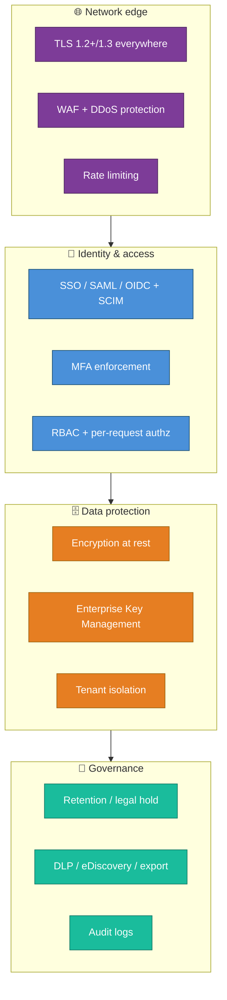
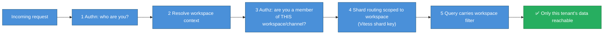
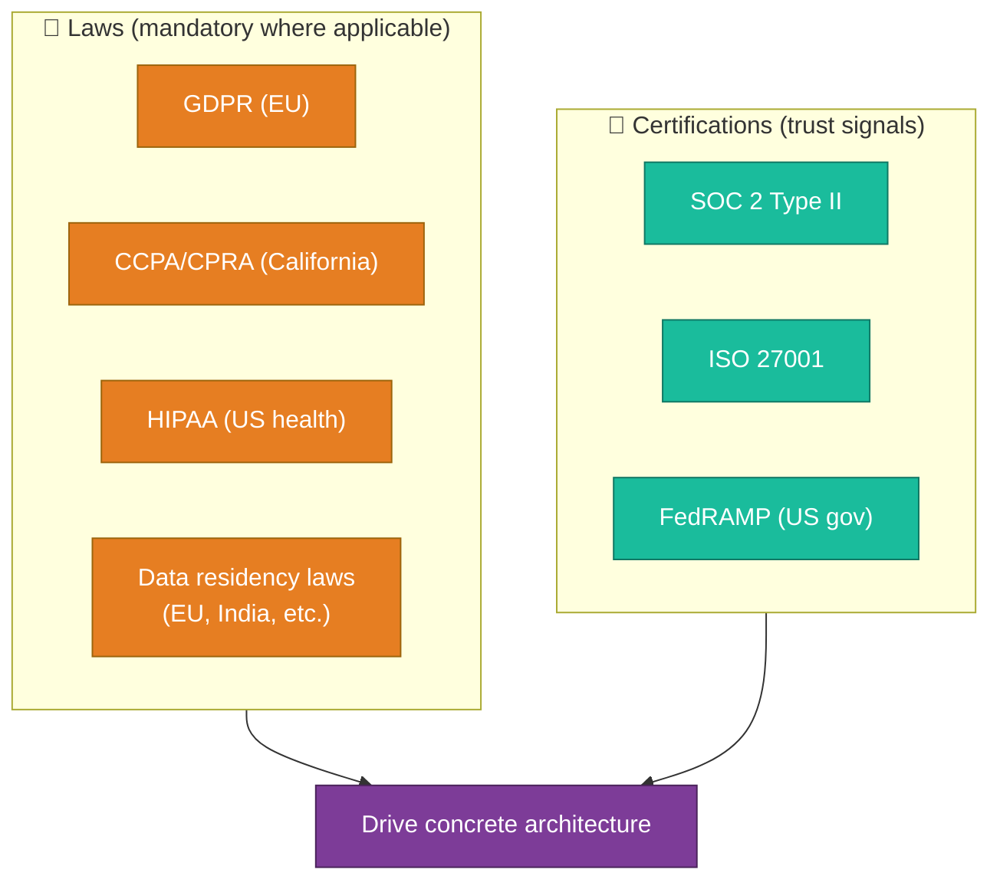

# 10 — Security, Privacy & Compliance

For an enterprise messaging platform, security and compliance are **not a feature —
they are the product**. A company won't put its most sensitive conversations on
infrastructure it doesn't trust. This file covers the controls a robust system
*must* have, and the laws that force them.

---

## The defense-in-depth picture

---

## Encryption

| Layer | Control | Notes |
|-------|---------|-------|
| **In transit** | TLS 1.2+/1.3 on every hop — client↔edge **and** service↔service (mTLS internally) | "Encrypted to the edge" isn't enough for enterprise; internal traffic is encrypted too |
| **At rest** | AES-256 on disks, DBs, object storage, backups, search indexes | Covers the *whole* data lifecycle, not just the primary DB |
| **Key management** | Centralized KMS; keys rotated; never in code/config | Cross-reference secrets handling in [02](./02-tech-stack.md) |
| **Enterprise Key Management (EKM)** | Lets *the customer* control encryption keys (via their own KMS) and **revoke access** to their data | Slack's real "Slack EKM" feature — a key enterprise differentiator |

:::note Why not end-to-end encryption (E2EE) like Signal?
Slack is **not** E2EE, and that's a deliberate product trade-off. E2EE would break
**server-side search, compliance/eDiscovery, DLP, bots, and admin export** — all
table-stakes for enterprise. Instead Slack offers **EKM**: the server *can* read
data to provide features, but the *customer* holds the keys and can cut off access.
This "encryption with customer-controlled keys" is the enterprise-messaging norm,
versus consumer messengers' E2EE. Know this distinction cold — it's a favorite
interview question.
:::

---

## Tenant isolation (the multi-tenant security core)

A workspace must **never** see another workspace's data. Defense is layered:

| Layer | Control |
|-------|---------|
| **Authz on every request** | Membership/permission checked per call — never trust the client's claim of which workspace it's in |
| **Shard key = tenant** | A query physically can't reach another tenant's shard ([04](./04-data-model-and-storage.md)) |
| **Search ACL filter in-query** | Permissions are a query filter, not a post-filter ([06](./06-search-and-indexing.md)) |
| **Cell isolation (optional)** | Big/regulated tenants in dedicated cells ([08](./08-scaling-challenges-and-solutions.md)) |
| **Short-TTL permission caches** | A removed member loses access fast — long TTLs are a security hole ([04](./04-data-model-and-storage.md)) |

---

## Identity & access management

| Control | Why |
|---------|-----|
| **SSO via SAML / OIDC** | Enterprises require central identity; no separate Slack passwords |
| **SCIM provisioning** | Auto-provision/**deprovision** users from the corporate directory — when HR offboards someone, Slack access dies automatically |
| **MFA enforcement** | Org-wide second factor |
| **RBAC** (member/admin/owner/guest) | Least privilege; guests see only invited channels |
| **Session management** | Revoke sessions, set timeouts, device approval |
| **OAuth scopes for apps** | Third-party apps get *narrow* scopes, not full access — blast-radius limiting (cross-ref Stripe study's restricted-keys idea) |

---

## Privacy laws & compliance frameworks

### How each requirement forces an architectural feature

| Requirement | What the law/standard demands | Architectural consequence |
|-------------|-------------------------------|---------------------------|
| **GDPR — right to erasure** | Delete a user's personal data on request | Need **hard-delete pipelines** that purge across DB, search index, backups, caches, logs — not just a tombstone |
| **GDPR/India — data residency** | EU/India data must stay in-region | **Region-pinned cells/shards** ([08](./08-scaling-challenges-and-solutions.md)); route a tenant's data to its region |
| **GDPR — data minimization / DSAR** | Collect only what's needed; export a user's data on request | Export tooling; avoid hoarding PII |
| **CCPA/CPRA** | Disclosure, opt-out of "sale," deletion | Consent + deletion machinery (overlaps GDPR) |
| **HIPAA** (healthcare customers) | Protect PHI; sign a BAA; audit access | **BAA**, encryption, strict audit logs, often a dedicated/segregated environment |
| **SOC 2 Type II** | Prove security controls operate over time | **Audit logging**, change management, access reviews, monitoring — *continuously*, with evidence |
| **Retention / legal hold** | Keep (or delete) data per policy & litigation holds | **Configurable retention** + **legal hold** that overrides deletion |
| **eDiscovery / DLP** | Search/export for legal; prevent leaks | Compliance export APIs, DLP integrations, the in-query ACL search ([06](./06-search-and-indexing.md)) |

:::caution Right-to-erasure vs. backups — a genuinely hard problem
"Delete my data" must reach **encrypted backups and replicas**, where you can't
easily edit a single record. Common production answers: (1) **crypto-shredding** —
delete the per-tenant/per-user encryption key so the backup data becomes
unrecoverable; (2) **backup expiry windows** documented in the privacy policy so
data ages out. This is exactly where **EKM/key-per-tenant** pays off — destroy the
key, destroy access. Mention this nuance and you signal real compliance depth.
:::

---

## Audit logging & monitoring

| What's logged | Why |
|---------------|-----|
| Auth events (login, MFA, SSO, failures) | Detect compromise; SOC 2 / forensics |
| Admin actions (member add/remove, setting changes, exports) | Accountability; tamper evidence |
| Data access by privileged systems | Insider-threat detection; HIPAA |
| Security events (rate-limit trips, anomalies) | Detection & response |

Audit logs are themselves **append-only and tamper-evident**, retained per policy,
and feed both **compliance evidence** and **incident response** ([09](./09-real-world-incidents.md)).

---

## Application & supply-chain security

| Threat | Control |
|--------|---------|
| Injection / XSS / CSRF | Input validation, output encoding, CSP, anti-CSRF tokens |
| Malicious file uploads | AV/malware scanning before serving; sandboxed previews |
| SSRF via link unfurls | Unfurl in a locked-down, egress-restricted sandbox (a real attack surface for chat apps) |
| Malicious third-party apps | Reviewed app directory, scoped OAuth, revocation |
| Dependency/supply-chain risk | SCA scanning, pinned deps, signed builds, SBOMs |
| Secrets leakage | Vault/KMS, secret scanning in CI, no secrets in code/logs |

:::tip Link unfurling is a classic chat-app vulnerability
When Slack shows a preview of a pasted URL, *the server fetches that URL*. If
unguarded, an attacker pastes `http://169.254.169.254/...` (cloud metadata
endpoint) and the **server** fetches internal resources — **SSRF**. The fix:
unfurl from an isolated service with **egress allow-lists** and blocked internal
ranges. Worth knowing as a concrete, chat-specific security design point.
:::

Next: **reliability targets and minimizing infra cost** →
[11-reliability-and-cost.md](./11-reliability-and-cost.md).
