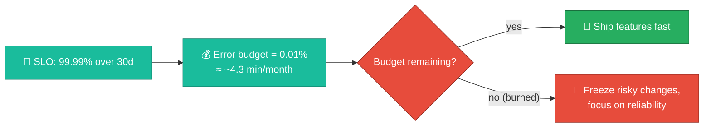
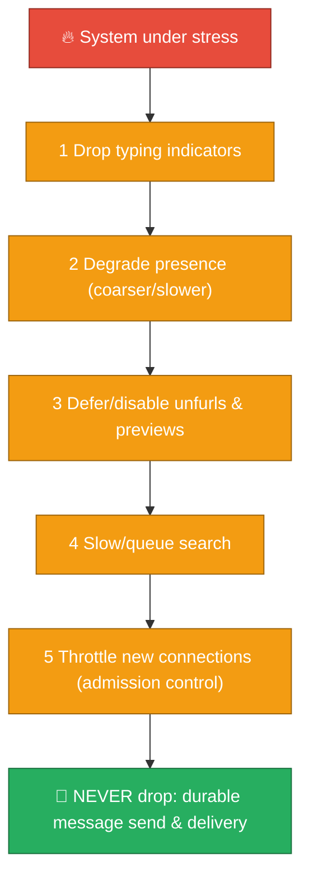
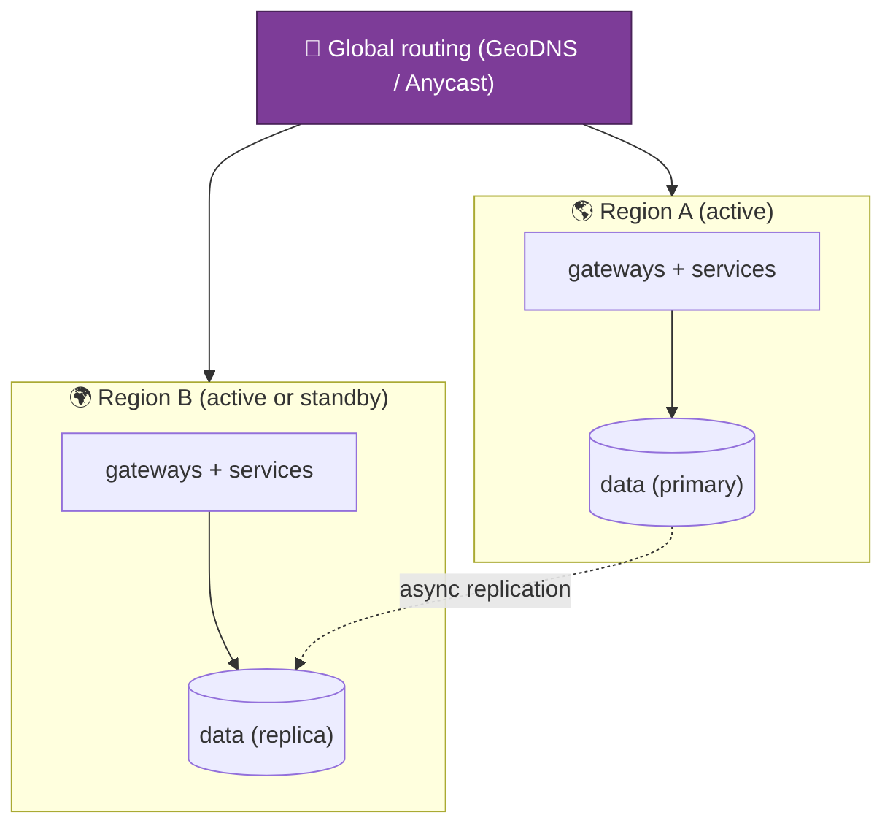
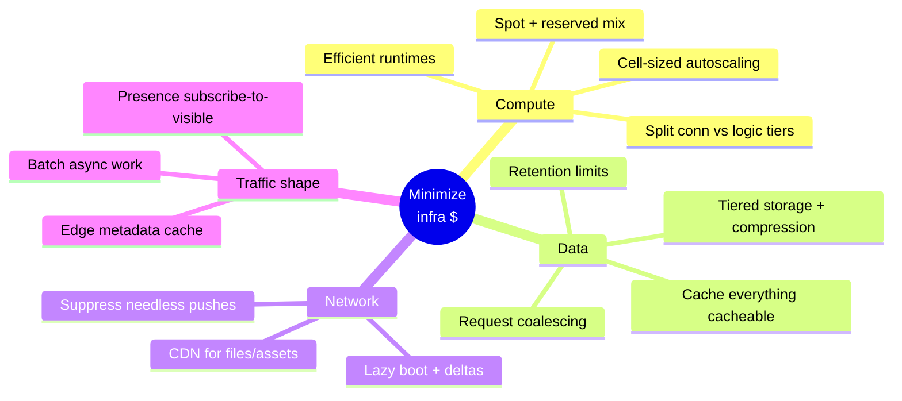

# 11 — Reliability & Cost Optimization

A robust system is not just "scales and is secure" — it must also be **operable**,
**recoverable**, and **affordable**. This file ties together SLOs, multi-region
resilience, disaster recovery, and the recurring **"minimize infra usage"** theme
into one place.

---

## SLOs & error budgets

You can't engineer reliability without a target. Define **SLOs** (objectives) per
critical path, measured by **SLIs** (indicators), and govern change velocity with
an **error budget**.

| Path | Example SLI | Example SLO (illustrative) |
|------|-------------|----------------------------|
| Message send→ack | p99 latency | &lt; 250 ms; success ≥ 99.99% |
| Message delivery (live) | p99 delivery latency intra-region | &lt; 500 ms |
| Connection establishment | success rate | ≥ 99.95% |
| Search query | p95 latency | &lt; 1 s |
| API availability | successful responses | ≥ 99.9% |

The error budget turns reliability into a **shared, quantified decision**: when
the budget is healthy you move fast; when it's burned you slow down. This is the
mechanism that prevents "move fast" and "stay up" from being a shouting match.

---

## Graceful degradation order

When overloaded, a robust system **sheds load in a defined order** — never
randomly. The rule: **protect the irreplaceable (messages), shed the cosmetic
(typing) first.**

This ordering reuses the **"match cost to value"** gradient from
[05](./05-presence-typing-and-unreads.md): the same reasoning that says "don't
durably store typing" says "drop typing first under load."

---

## Multi-region & disaster recovery

| Concern | Approach | Trade-off |
|---------|----------|-----------|
| **Region failure** | Failover to another region (active-active or active-standby) | Active-active is costlier but near-zero RTO; standby is cheaper but slower failover |
| **Replication** | Async cross-region (sync would add too much latency to the write path) | Possible small data loss window (RPO > 0) on sudden region loss |
| **Data residency** | EU/India tenants pinned to in-region cells | Limits where failover can go ([10](./10-security-privacy-and-compliance.md)) |
| **RTO / RPO targets** | Define recovery-time & recovery-point objectives per data class | Drives how much you spend on replication & standby |
| **DR drills** | Regularly *practice* failover (game days) | A DR plan never tested is a DR plan that doesn't work — recall [09](./09-real-world-incidents.md)'s "test the recovery path" |

:::tip The realistic stance
Messaging writes favor **low latency**, so cross-region replication is usually
**async** — accepting a small RPO rather than paying synchronous-cross-region
latency on every message. You buy down the risk with frequent, *tested* failover
rather than by making every write globally synchronous.
:::

---

## Observability (you can't operate what you can't see)

Alert on **symptoms and SLO burn rate** (user-facing pain), not just causes — and
always have **p99/p999** dashboards, the metric that surfaced Discord's GC problem
([09](./09-real-world-incidents.md)).

---

## Minimizing infra usage — the consolidated playbook

This theme recurs in every file; here it is in one table. **Robust ≠ wasteful — the
best designs are cheaper *because* they're well-architected.**

| Lever | Where it appears | Saving |
|-------|------------------|--------|
| **Separate connection tier from logic** | [02](./02-tech-stack.md), [08](./08-scaling-challenges-and-solutions.md) | Run idle sockets on cheap memory-optimized nodes; don't burn logic CPUs to hold connections |
| **Efficient connection runtime (BEAM/epoll)** | [02](./02-tech-stack.md) | Hundreds of thousands of conns per node |
| **Edge cache (Flannel-style)** | [03](./03-realtime-messaging-architecture.md) | Massive DB-load reduction; metadata answered at the edge |
| **Aggressive caching (Redis/Memcached)** | [04](./04-data-model-and-storage.md) | Every cache hit is a DB read you didn't pay for |
| **Request coalescing** | [04](./04-data-model-and-storage.md), [09](./09-real-world-incidents.md) | 1 DB read serves N concurrent identical reads |
| **Presence subscribe-to-visible-only** | [05](./05-presence-typing-and-unreads.md) | Eliminated the bulk of presence traffic |
| **Lazy boot + deltas** | [07](./07-client-and-mobile.md), [08](./08-scaling-challenges-and-solutions.md) | Less bandwidth, less server work per connect |
| **Notification suppression** | [07](./07-client-and-mobile.md) | Fewer APNs/FCM pushes + less server work |
| **Files → object storage + CDN** | [02](./02-tech-stack.md), [04](./04-data-model-and-storage.md) | Cheap durable storage; offload egress to CDN |
| **Tiered storage + compression + retention** | [04](./04-data-model-and-storage.md) | Cold data on cheap tiers; free-tier history limits let you delete |
| **Tenant bin-packing (search & shards)** | [06](./06-search-and-indexing.md) | High utilization; don't dedicate a node to a 5-person team |
| **Right runtime for hot paths (Rust/Scylla)** | [09](./09-real-world-incidents.md) | Fewer nodes for the same load |
| **Cell-based scaling** | [08](./08-scaling-challenges-and-solutions.md) | Add capacity incrementally; size cells to demand |
| **Spot/reserved instance mix + autoscaling** | platform | Pay for baseline reserved, burst on cheaper spot |

---

## The robust-system checklist (what "production-grade" means here)

| Pillar | Must have |
|--------|-----------|
| **Correctness** | Durable, ordered, exactly-once-feel messages ([03](./03-realtime-messaging-architecture.md)) |
| **Scalability** | Fan-out, sharding, cells, hot-shard handling ([04](./04-data-model-and-storage.md), [08](./08-scaling-challenges-and-solutions.md)) |
| **Availability** | Multi-AZ/region, graceful degradation, admission control |
| **Recoverability** | Tested DR, defined RTO/RPO, recovery-from-zero runbooks ([09](./09-real-world-incidents.md)) |
| **Security** | Encryption, tenant isolation, EKM, IAM ([10](./10-security-privacy-and-compliance.md)) |
| **Compliance** | GDPR/CCPA/HIPAA, residency, retention, audit ([10](./10-security-privacy-and-compliance.md)) |
| **Observability** | Metrics/traces/logs, SLOs, p99 alerting |
| **Cost efficiency** | The playbook above — robust *and* lean |
| **Operability** | Safe deploys, canaries, runbooks, game days |

Next: **the glossary of every term used** →
[12-glossary.md](./12-glossary.md).
