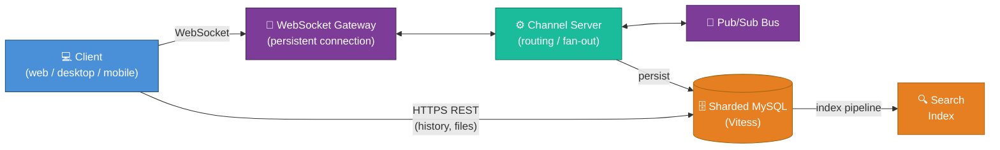

# Slack Architecture — Senior Engineer / Architect Deep Dive

A from-scratch, production-grade architectural breakdown of how a real-time team
messaging platform like **Slack** is built and operated at scale — and how
**Discord** solves the same problems differently. Written for senior backend,
full-stack, and architect interviews, and as a reference design you could
actually build a system from.

> **How to read this.** Each file is self-contained but they build on each other.
> Start with `01` for requirements and scale, `02` for the stack, then `03`–`07`
> for the architecture, `08`–`09` for scaling & war stories, and `10`–`11` for
> the cross-cutting concerns (security, compliance, reliability, cost) that
> separate a toy from a real system.

## Index

| File | What it covers |
|------|----------------|
| [01-overview-and-requirements.md](./01-overview-and-requirements.md) | Product surface, functional & non-functional requirements, scale numbers, CAP/PACELC stance, back-of-envelope capacity math |
| [02-tech-stack.md](./02-tech-stack.md) | Every layer of the stack — languages, frameworks, datastores, caches, queues, infra — **with the "why" and the trade-off for each** |
| [03-realtime-messaging-architecture.md](./03-realtime-messaging-architecture.md) | The core: WebSocket gateways, the channel server, message fan-out, pub/sub, ordering, delivery guarantees |
| [04-data-model-and-storage.md](./04-data-model-and-storage.md) | Sharding strategy (Vitess/MySQL), message storage, Discord's Cassandra→ScyllaDB journey, hot partitions |
| [05-presence-typing-and-unreads.md](./05-presence-typing-and-unreads.md) | The deceptively hard problems: presence, typing indicators, unread counts at scale |
| [06-search-and-indexing.md](./06-search-and-indexing.md) | Search architecture, indexing pipeline, multi-tenant isolation, relevance |
| [07-client-and-mobile.md](./07-client-and-mobile.md) | Client architecture, cold-start sync, offline, reconnection storms, push notifications, mobile battery/data |
| [08-scaling-challenges-and-solutions.md](./08-scaling-challenges-and-solutions.md) | The thundering herd, fan-out to large channels, the "Slacky Tuesday" problem, cell-based architecture |
| [09-real-world-incidents.md](./09-real-world-incidents.md) | Publicly reported postmortems: Slack's Jan 2021 outage, Discord trillion-message migration, Cassandra hot partitions, and the lessons |
| [10-security-privacy-and-compliance.md](./10-security-privacy-and-compliance.md) | Encryption (in transit / at rest / EKM), tenant isolation, GDPR/CCPA, SOC 2, HIPAA, data residency, retention |
| [11-reliability-and-cost.md](./11-reliability-and-cost.md) | SLOs/error budgets, multi-region, disaster recovery, and **how to minimize infra spend** without sacrificing reliability |
| [12-glossary.md](./12-glossary.md) | Every term, acronym, and Slack/Discord-specific concept used in this folder |

## The 30-Second Mental Model

Slack is, at its heart, **a real-time pub/sub system bolted onto a durable,
searchable message store, multiplied by millions of isolated tenants
(workspaces)**.

**The key insight that drives every design decision below:** a message sent to a
channel must be *durably stored once* and *delivered in real time to every
currently-connected member of that channel, on every device, in order, exactly
once from the user's perspective* — across millions of channels and tens of
millions of simultaneous WebSocket connections. Almost every hard problem in
this folder is a consequence of that one sentence.

## Conventions used in this folder

- **Diagrams are Mermaid** and render interactively (zoom, dark-mode aware,
  color-coded by layer). Blue = client, purple = edge, teal = compute, orange = data.
- Sources are **publicly reported** engineering talks/blog posts (Slack
  Engineering, Discord Engineering, Vitess, PlanetScale). Where a number is an
  estimate for illustration, it's labelled *(illustrative)*.
- Each scaling problem is presented as **Problem → Naive solution → Why it
  breaks → Production solution → Trade-off**, because that's how interviews and
  real design reviews actually go.
